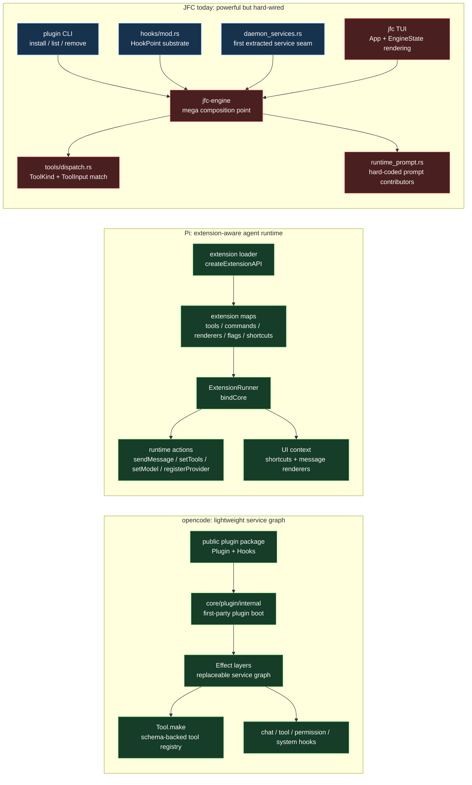
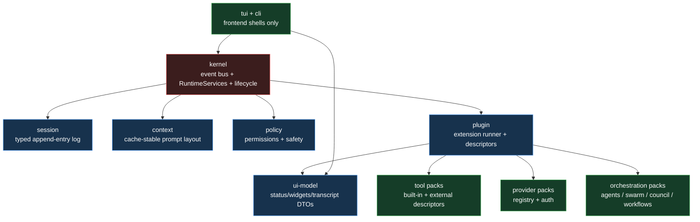
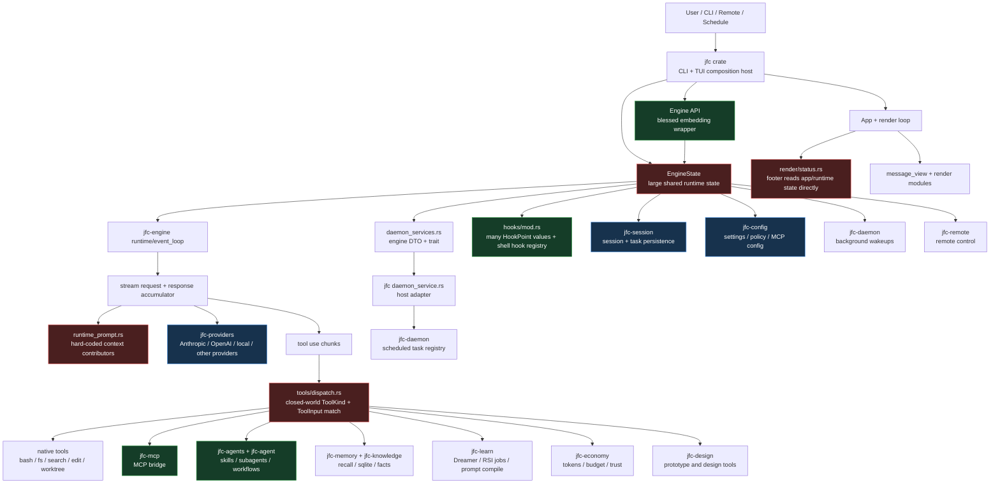
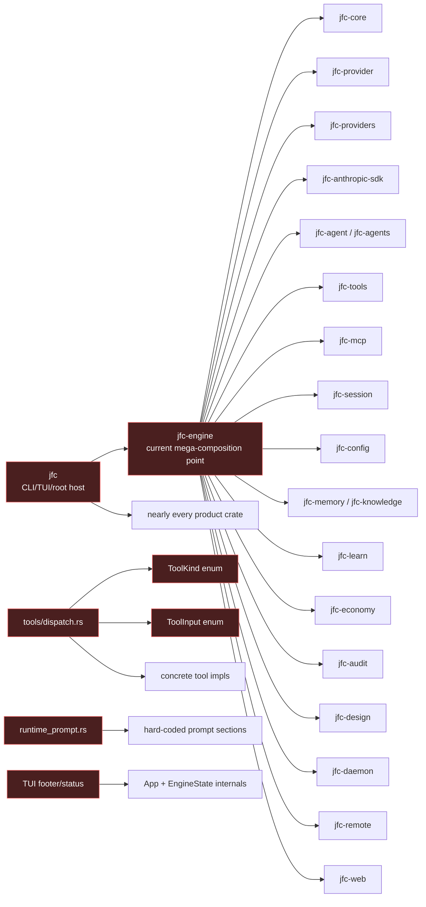
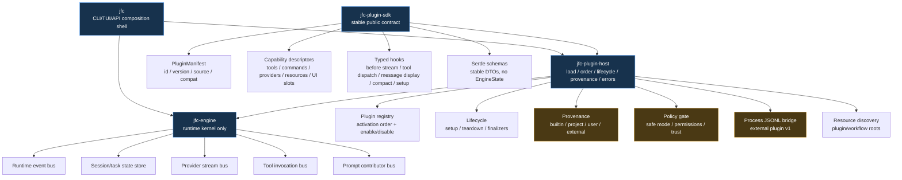
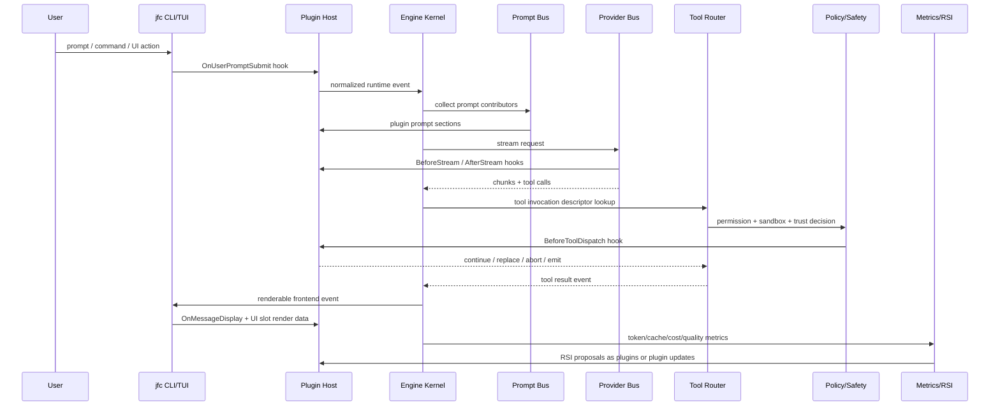
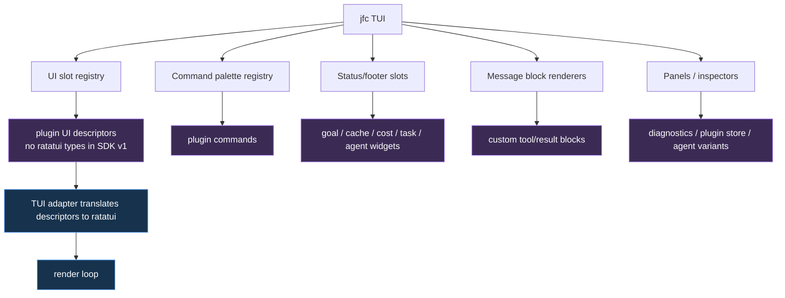
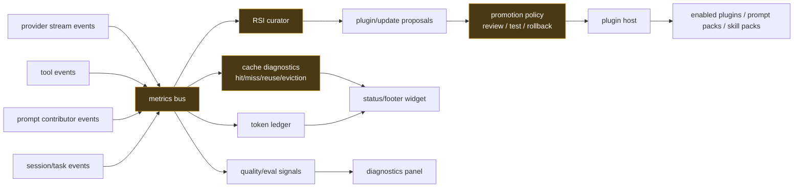
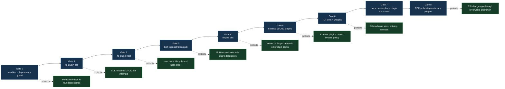

# JFC Architecture Map

This is the root Mermaid map for JFC's infrastructure. It is intentionally progressive: start with the current factory floor, compare it against opencode and Pi, then follow the belts toward the plugin-first architecture where built-ins and external mods use the same contract.

Source anchors used for this map:

- `Cargo.toml` workspace metadata.
- `crates/jfc-engine/src/engine.rs`: embedding API and the current `EngineState` boundary.
- `crates/jfc-engine/src/hooks/mod.rs`: hook point and hook registry substrate.
- `crates/jfc-plugin-host/src/host.rs`: ordered plugin hook execution, including stop-capable hook payload propagation.
- `crates/jfc-engine/src/tools/dispatch.rs`: current closed-world tool dispatch.
- `crates/jfc-engine/src/tools/descriptor_router.rs`: first descriptor-backed built-in tool route and catalog adapter.
- `crates/jfc-engine/src/tools/descriptor_external_routes.rs`: MCP descriptor executor route and structured external-route error mapping.
- `crates/jfc-engine/src/tools/descriptor_catalog.rs`: process-wide external tool descriptor snapshot used by model tool advertisement and dispatch.
- `crates/jfc-engine/src/app/permissions.rs`: permission-mode decisions, including registered external descriptor policies.
- `crates/jfc-engine/src/tools/descriptor_process_bridge.rs`: JSONL process bridge executor for plugin-owned tools.
- `crates/jfc-core/src/tool_input.rs` and `crates/jfc-core/src/tool_kind.rs`: current tool schema/kind enums.
- `crates/jfc-engine/src/stream/request/runtime_prompt.rs`: runtime prompt state assembly for prompt-context descriptor execution.
- `crates/jfc-engine/src/stream/request/runtime_extensions.rs`: descriptor-backed prompt-context runtime extension execution.
- `crates/jfc-engine/src/stream/request/runtime_prompt_context_builtins.rs`: built-in prompt-context handler bodies for first-party descriptors, including turn-scoped reminders.
- `crates/jfc-engine/src/stream/request/prompt_context_bridge.rs`: JSONL process bridge runner for prompt-context runtime extension refreshes.
- `crates/jfc-engine/src/stream/request/prompt_context_state.rs`: persisted prompt-context snapshots, bridge state reuse, and refresh cadence policy.
- `crates/jfc-engine/src/feature_gates.rs`: feature-gate status context and Marsh bash-output buffer feeding prompt-context descriptors.
- `crates/jfc-engine/src/daemon_services.rs`: first engine-owned service boundary for daemon-backed scheduled tasks.
- `crates/jfc/src/daemon_service.rs`: current concrete adapter from engine service DTOs into `jfc-daemon`.
- `crates/jfc-plugin-sdk/src/lib.rs`: public plugin contract crate, independent from engine/TUI internals.
- `crates/jfc-plugin-sdk/src/bridge.rs`: typed process bridge frames for manifest, descriptor, hook, and tool calls.
- `crates/jfc-plugin-sdk/PROCESS_BRIDGE.md`: author-facing process-bridge JSONL ABI guide.
- `crates/jfc-plugin-sdk/src/capability.rs`: UI-neutral slot capabilities and runtime-extension capability metadata.
- `crates/jfc-plugin-sdk/src/metric.rs`: UI-neutral metric descriptor DTOs for status-line/sidebar/panel surfaces.
- `crates/jfc-plugin-sdk/src/agent_launch.rs`: executable agent-launch descriptor DTOs.
- `crates/jfc-plugin-sdk/src/runtime_action.rs`: curated runtime-action descriptor DTOs without `EngineState` exposure.
- `crates/jfc-plugin-sdk/src/runtime_action_payload.rs`: shared runtime-action payload parsers and typed payload errors for manifests, host diagnostics, and TUI adapters.
- `crates/jfc-plugin-sdk/src/service.rs`: host-visible service descriptors for built-in management surfaces.
- `crates/jfc-plugin-sdk/src/ui_panel.rs`: UI panel descriptor contract for host-owned plugin panel sections.
- `crates/jfc-plugin-sdk/src/ui_widget.rs`: UI widget descriptor, process-bridge refresh descriptor, and cadence hint contracts.
- `crates/jfc-plugin-sdk/src/teammate.rs`: process-bridge teammate mailbox and ready/idle helper DTOs.
- `crates/jfc-plugin-sdk/examples/teammate_helper_agent.rs`: copyable JSONL process-bridge teammate helper example.
- `crates/jfc-plugin-sdk/examples/prompt_context_provider.rs`: copyable JSONL prompt-context process-bridge contributor example.
- `crates/jfc-plugin-sdk/examples/process_bridge_tool.rs`: copyable JSONL process-bridge tool example.
- `crates/jfc-plugin-sdk/examples/process_bridge_provider.rs`: copyable JSONL process-bridge provider example.
- `crates/jfc-plugin-sdk/examples/ui_diagnostics_panel.rs`: copyable JSONL UI widget refresh helper example.
- `crates/jfc-plugin-sdk/examples/README.md`: process-bridge teammate, tool, provider, prompt-context, and UI diagnostics plugin manifest examples.
- `crates/jfc-plugin-sdk/src/runtime_extension.rs`: executable message-renderer and prompt-context descriptor DTOs.
- `crates/jfc-plugin-host/src/lib.rs`: plugin lifecycle, descriptor, hook, discovery, and status host.
- `crates/jfc-plugin-host/src/descriptor_issue_types.rs`: serializable descriptor issue DTOs and typed repair actions for reload/doctor/TUI diagnostics.
- `crates/jfc-plugin-host/src/descriptor_issues.rs`: host-level descriptor graph cross-reference validation for runtime actions, panels, widgets, and command-palette slots.
- `crates/jfc-plugin-host/src/builtin_metrics.rs`: first-party cache diagnostics and RSI runtime observability pack.
- `crates/jfc-plugin-host/src/builtin_prompt_context.rs`: first-party prompt-context runtime extension pack.
- `crates/jfc-plugin-host/src/builtin_agent_workflow.rs`: first-party agent, skill, and workflow resource descriptors.
- `crates/jfc-plugin-host/src/builtin_plugin_management.rs`: first-party plugin store/install/update/remove/doctor service descriptors.
- `crates/jfc-plugin-host/src/manifest.rs`: `.jfc-plugin.toml` manifest parsing for resources, process bridges, tool descriptors, provider descriptors, UI slots, metric descriptors, runtime actions, runtime extensions, and agent launches.
- `crates/jfc-plugin-host/src/manifest_ui_panel.rs`: manifest adapter for plugin-declared UI panel descriptors.
- `crates/jfc-plugin-host/src/manifest_runtime_action.rs`: manifest adapter for plugin-declared runtime-action descriptors.
- `crates/jfc-plugin-host/src/manifest_agent_launch.rs`: manifest adapter for plugin-declared agent launch descriptors.
- `crates/jfc-plugin-host/src/process_bridge.rs`: host-side process bridge `Describe` client for descriptor discovery.
- `crates/jfc-plugin-host/src/state_cache.rs`: project-scoped discovered plugin host cache and explicit reload boundary.
- `crates/jfc-plugin-host/src/status.rs`: plugin host status snapshot and compact health summary.
- `crates/jfc-engine/src/agents/launch.rs`: descriptor-backed agent-launch selection, including project launcher lookup.
- `crates/jfc-engine/src/swarm/process_bridge_teammate_loop.rs`: persistent bidirectional teammate process bridge loop.
- `crates/jfc-engine/src/swarm/process_bridge_teammate_host_requests.rs`: host-owned mailbox and ready/idle handling for teammate bridge requests.
- `crates/jfc-engine/src/stream/request/prepare.rs`: request preparation captures active RSI runtime counts for metric consumers.
- `crates/jfc-engine/src/stream/request/behavior_prompt.rs`: request-time behavioral prompt state for brief/Pewter/interaction descriptor handlers.
- `crates/jfc/src/render/status_plugins.rs`: TUI adapter from plugin health, slot descriptors, metric descriptors, and diagnostic runtime actions into footer/sidebar rows.
- `crates/jfc/src/app/plugin_widget_refresh.rs`: host-owned widget refresh orchestration, diagnostics, and auto-refresh scheduling.
- `crates/jfc/src/app/plugin_widget_refresh_policy.rs`: bounded widget refresh cadence and debounce policy.
- `crates/jfc/src/app/plugin_widget_bridge.rs`: JSONL process bridge runner for widget refresh requests.
- `crates/jfc/src/app/plugin_widget_state.rs`: persisted widget snapshots and in-memory widget refresh status.
- `crates/jfc/src/input/host_palette_action.rs`: typed host-owned command-palette action parser and executor.
- `crates/jfc/src/input/palette_slash_action.rs`: typed slash-command palette action parser backed by the merged slash-command registry.
- `crates/jfc/src/input/runtime_action_metrics.rs`: TUI runtime-action adapter for refreshing plugin metric/status descriptors.
- `crates/jfc/src/input/runtime_action_open_panel.rs`: typed OpenPanel runtime-action target parser and navigation executor.
- `crates/jfc/src/input/runtime_action_prompt_context.rs`: TUI runtime-action adapter for refreshing prompt-context descriptors for the next request.
- `crates/jfc/src/render/status_panels.rs`: TUI formatter for descriptor-backed plugin panel sections.
- `crates/jfc/src/render/status_widgets.rs`: TUI widget row adapters for info sidebar, task panel, and session sidebar.
- `crates/jfc/src/render/sidebar_panels.rs`: right-sidebar metric, usage, LSP, and MCP panel rows.
- `crates/jfc/src/cli/plugin/diagnostics.rs`: `jfc plugin doctor` reload/cache diagnostics and descriptor inventory output.
- `crates/jfc/src/cli/plugin/doctor_rows.rs`: `jfc plugin doctor` service, metric, panel, and widget row formatting.
- `crates/jfc/src/cli/plugin/doctor_runtime_rows.rs`: `jfc plugin doctor` runtime-action/runtime-extension inventory row formatting.
- `crates/jfc/src/cli/plugin/doctor_issue_rows.rs`: `jfc plugin doctor` descriptor issue row formatting.
- `crates/jfc/src/plugin_paths.rs`: shared plugin-store root and plugin-name validation helpers.
- `crates/jfc/src/plugin_smoke.rs`: shared process-bridge plugin author smoke checks for installed tool/provider descriptors.
- `crates/jfc/src/plugin_smoke/bridge.rs`: JSONL bridge process runner used by plugin smoke.
- `crates/jfc/src/input/runtime_action_router.rs`: safe TUI runtime-action executor for descriptor-declared actions.
- `crates/jfc/src/input/runtime_action_smoke.rs`: TUI runtime-action adapter for plugin smoke checks and pass/fail toasts.
- `crates/jfc/src/input/runtime_action_plugin_diagnostics.rs`: TUI runtime-action adapter that refreshes plugin descriptor state, summarizes descriptor issues, and runs discovered plugin-smoke checks.
- `.research/magic-context/ARCHITECTURE.md` and `.research/magic-context/STRUCTURE.md`: reference implementation for cache-stable context layout, historian compartments, memory capture, recall/search, and dreamer maintenance.
- `PLAN.md`: current SQLx migration plan and follow-on Magic Context parity roadmap for JFC.
- `crates/jfc/src/cli/plugin/descriptor_rows.rs`: `jfc plugin doctor` inventory rows for tool and provider descriptors.
- `crates/jfc/src/cli/plugin/template_definitions.rs`: installable first-party SDK plugin template catalog and copied example sources.
- `crates/jfc/src/cli/plugin/template_definitions/template_render.rs`: first-party SDK plugin template manifests and README bodies.
- `crates/jfc/src/cli/plugin/templates.rs`: first-party SDK plugin template install/list orchestration.
- `crates/jfc-engine/src/workflows/plugin_discovery.rs`: workflow plugin directory discovery delegated to the plugin host.
- `crates/jfc-core/tests/workspace_dependency_rules.rs`: dependency-direction guard for the plugin spine.
- `crates/jfc/src/cli/plugin.rs`: existing plugin CLI surface.
- `.omo/plans/jfc-all-plugin-refactor.md`: target all-plugin refactor plan.
- `/home/cole/WebstormProjects/forks/opencode/packages/plugin/src/index.ts`: opencode public plugin hooks.
- `/home/cole/WebstormProjects/forks/opencode/packages/plugin/src/v2/effect/plugin.ts`: opencode V2 plugin shape.
- `/home/cole/WebstormProjects/forks/opencode/packages/core/src/plugin/internal.ts`: opencode first-party plugin boot path.
- `/home/cole/WebstormProjects/forks/opencode/packages/core/src/tool/tool.ts`: opencode schema-backed tool registry.
- `/home/cole/WebstormProjects/forks/opencode/packages/core/src/effect/layer-node.ts`: opencode typed service graph composition.
- `/home/cole/WebstormProjects/forks/pi/packages/coding-agent/src/core/extensions/loader.ts`: Pi extension API and loader.
- `/home/cole/WebstormProjects/forks/pi/packages/coding-agent/src/core/extensions/runner.ts`: Pi extension runner bound into the live session.
- `/home/cole/WebstormProjects/forks/pi/packages/coding-agent/src/core/extensions/types.ts`: Pi loaded extension shape.
- `/home/cole/WebstormProjects/forks/pi/packages/coding-agent/src/core/agent-session.ts`: Pi agent session owns an extension runner.

## Reference Architecture Comparison

opencode and Pi both feel lightweight because they put the extension seam before product behavior hardens into app internals.

opencode's main move is a small public plugin contract plus a typed service graph. Its public `Hooks` surface can add tools/providers/auth, mutate chat params and headers, intercept permission asks, run before/after tools, alter shell env, transform system/messages, and mutate tool definitions. Its V2 plugin shape is even smaller: `{ id, effect(context) }`. First-party capabilities are booted through `core/plugin/internal.ts`, so built-ins and configured plugins are conceptually on the same rail. Tools are schema-backed definitions registered into a service, not variants in one central app enum.

Pi's main move is a live extension runtime. `createExtensionAPI` lets extensions register tools, slash commands, shortcuts, flags, custom message renderers, and providers. It also exposes curated runtime actions: send messages, append entries, set session name/labels, get and set active tools, refresh tools, set model/thinking level, execute commands, register/unregister providers, and use the event bus. `ExtensionRunner` starts with safe stubs, then `bindCore()` attaches those actions to the live session/UI/provider registry once the runtime exists. That is why Pi feels more "mod the whole agent" than opencode.

JFC has more raw machinery than both in several areas: hooks, MCP, plugin install/list/remove CLI, skills, agents, providers, task/session stores, Dreamer/RSI jobs, goals, economy/cost/trust, design tools, voice, and a richer TUI. The gap is not capability. The gap is seam placement: JFC usually wires the feature first inside `jfc-engine` or `jfc`, then exposes a partial hook later. opencode and Pi expose a stable extension seam first, then hang features from it.

This document treats the current JFC shape as a teardown target, not as the architecture to preserve. The goal is to keep useful capabilities while replacing the primitives underneath them with Pi/opencode-shaped primitives: session runtime factory, service graph, extension runner, descriptor registries, typed append entries, and curated runtime actions. That includes the repository shape itself: the current `jfc-*` crate sprawl is not the target style.



## Design Differences

| Area | opencode | Pi | JFC today | What JFC should change |
| --- | --- | --- | --- | --- |
| Architecture center | Effect service graph and plugin hooks | Agent session plus extension runner | `jfc-engine` as broad composition point | Make `jfc-engine` a kernel with buses, move product behavior to plugin packs |
| Plugin API | Public `Plugin`/`Hooks` package | `ExtensionAPI` factory API | Plugin CLI plus shell/config hooks | Add `jfc-plugin-sdk` with descriptors and runtime action DTOs |
| Runtime host | Plugin boot path registers first-party and external behavior | `loadExtensions` + `ExtensionRunner` | No central runtime plugin host | Add `jfc-plugin-host` for discovery, lifecycle, ordering, provenance, status |
| Tools | Schema-backed `Tool.make` registry | Extensions can `registerTool` | Closed `ToolKind` and `ToolInput` enums with dispatch match | Add tool descriptors and handler registry before adding more tools |
| Providers | Provider/auth hooks | Extensions can dynamically `registerProvider` | Provider trait exists, concrete providers are engine dependencies | Add provider descriptors and dynamic provider registration |
| Prompt/context | Chat params/system/message transform hooks | Extension handlers and session runtime actions | `runtime_prompt.rs` hard-codes contributors | Add prompt contributor bus |
| UI modding | Mostly core/plugin hooks; less UI-deep | Strong: shortcuts, UI context, message renderers | TUI reads `App`/`EngineState` directly | Add UI slots: footer, panels, message renderers, command palette |
| Safety | Permission service stays central; plugins can hook decisions | Runtime actions are curated and stale contexts are invalidated | Safe mode exists, but hooks/tools/plugin CLI are separate surfaces | Host-level safe-mode/provenance/permission gate for every plugin capability |
| Built-ins | First-party plugins boot through plugin internals | Built-ins and extensions share runner-era registries | Built-ins wired directly in engine/TUI | Convert built-ins into first-party plugin packs |

## Translation For JFC

Copy opencode's contract discipline:

- public SDK crate separate from engine internals
- built-ins registered through the same contract as user plugins
- schema-backed tool definitions
- service graph / layer replacement mindset
- permission and policy kept central
- small plugin units that register through an effect/service context, not direct engine calls

Copy Pi's runtime affordances:

- extension runner with loaded extension maps
- runtime actions exposed as a curated API
- command, shortcut, flag, and message-renderer registration
- dynamic provider registration
- extension UI context without raw TUI ownership
- stale-context invalidation after reload/session replacement
- typed append-only session entries for model changes, labels, custom messages, compactions, and branches

Do not copy the loose parts:

- do not expose raw `EngineState`
- do not make Rust dynamic libraries the v1 ABI
- do not let plugins mutate arbitrary app state
- do not make UI plugins depend on ratatui widget internals
- do not keep adding enum variants for external tools
- do not preserve `EngineState` as the real kernel API
- do not keep feature code in flat root-level files when it belongs below a domain module

## Current Folder and Crate Audit

JFC's present layout is strong on crate count but weak on ownership clarity.

| Current shape | Problem | Target primitive |
| --- | --- | --- |
| `crates/jfc-engine/src/*.rs` with many top-level domains | A flat engine root makes every capability look engine-owned | Domain directories: `runtime/`, `context/`, `tools/`, `plugins/`, `providers/`, `workflow/`, each with a curated `mod.rs` |
| `EngineState` as shared bag | Features couple through one mutable struct | `AgentRuntime { session, services, diagnostics }` plus typed service traits |
| `tools/dispatch.rs` + `ToolKind` / `ToolInput` | Closed enum growth fights plugin descriptors | Descriptor registry + handler table; built-ins register like plugins |
| Session JSON + sidecars + archives + task stores | State is spread across files with partial invariants | Typed append-entry log with side tables derived from entries |
| TUI reads app/runtime internals directly | UI features cannot be replaced or tested as plugins | UI slots/widgets/runtime actions with DTOs |
| Memory/learn/session/compaction split by implementation | Hippocampus behavior is scattered | One `context` domain: layout, history, memory, recall, reduce, health, maintenance |
| Every crate/folder named `jfc-*` | Product prefix hides ownership and encourages crate-per-feature sprawl | Short package roots like `kernel`, `runtime`, `session`, `context`, `plugin`, `tui`, `cli`, `packs` |

Rust module rule for the rewrite: use module trees like `std::collections::btree` or `rustc_middle::ty` — parent modules curate vocabulary and public surface, child modules own roles. Split crates only for dependency isolation, reuse, or public versioning; otherwise split modules first.

**Engine Root Module Freeze:** the existing root-level `crates/jfc-engine/src/*.rs`
files are migration debt, not precedent. New product-domain Rust files must live
under an owning domain directory or destination crate; any temporary root-level
exception must be added to the explicit architecture-test allowlist with evidence.

## Bare Kernel Definition

The future JFC kernel should be boring. If a subsystem could be shipped as a
first-party plugin, it should not live in the kernel.

Kernel responsibilities:

- typed event bus and scoped stream/task lifecycle;
- append-only session entry interface and active-leaf coordination;
- service graph / registry for providers, tools, context, policy, sessions,
  plugins, and UI view models;
- permission/safe-mode/provenance gate before actions execute;
- cancellation, backpressure, and lifecycle cleanup;
- frontend-neutral effects and diagnostics.

Non-kernel responsibilities:

- concrete tools, provider implementations, slash commands, GitHub, web search,
  research, council, economy, voice, design, LSP, workflow optimizer, memory,
  dreamer, context reduction, dashboard/sidebar widgets, plugin management, and
  prompt contributors.



## Crate Teardown Map

| Current owner | Keep | Move out |
| --- | --- | --- |
| `jfc-engine` | event types, turn lifecycle, runtime service traits, minimal runtime ops | tools, commands, prompt assembly, compaction policy, session serialization, agents/swarm/council, daemon, GitHub, web/research, LSP, review/slop, provider bridges, UI/status concerns |
| `jfc` | ratatui drawing, terminal input polling, CLI arg parsing, frontend effect application | plugin UI state/refresh, runtime-action semantics, plugin management/smoke, auth workflows, daemon/bridge/remote/memory/audit command logic, voice runtime, domain row construction |
| `jfc-session` | typed session entries, task store, catalog/search/inbox, derived side tables | none; expand it to absorb engine-local session serialization and archives |
| `jfc-learn` | historian/dreamer/user-memory/RSI jobs as background services | hot-path prompt contributors should become `jfc-context` contributors |
| `jfc-memory` / `jfc-knowledge` | memory model + durable store | runtime injection policy and cache layout decisions move to `jfc-context` |
| `jfc-plugin-host` / `jfc-plugin-sdk` | descriptors, manifests, process bridge, extension/runtime action DTOs | broaden to own first-party pack registration; do not leave built-ins hard-wired |

Migration rule: introduce the destination service trait first, then move concrete
code behind it. Moving files before cutting the trait seams will create circular
dependencies and preserve the god crate under a different name.

## Target File Structure

The destination should look closer to Pi/opencode package roots than to the
current `jfc-*` crate fan-out:

```text
crates/
  kernel/        # minimal runnable kernel
  protocol/      # stable DTOs and typed IDs
  runtime/       # session runtime factory + service graph
  session/       # typed append-entry log and projections
  plugin/        # public SDK + host + extension runner
  context/       # Magic Context-style hippocampus subsystem
  policy/        # permissions / trust / safe mode
  tools/         # built-in tool pack registry and implementations
  providers/     # provider registry and built-in provider packs
  orchestration/ # agents / swarm / council / workflow / goals
  daemon/        # scheduled and detached execution
  ui-model/      # frontend-neutral view models
  tui/           # ratatui frontend
  cli/           # command-line frontend
```

Rust package names may still publish as `jfc-kernel` etc. if needed, but repo
paths should be ownership names. The folder tree should teach contributors where
new code belongs before they open a file.

## Magic Context Translation Target

Magic Context's useful lesson for JFC is not its TypeScript implementation; it is the cache-stable hippocampus architecture. JFC should absorb that as a first-party context plugin pack backed by Rust crates:

| Magic Context concept | JFC destination | Notes |
| --- | --- | --- |
| m[0] stable baseline + m[1] volatile delta | `jfc-engine` request prep + `jfc-session` persisted layout state | Rename to domain types such as `StableContextBaseline` and `ContextDelta`; do not expose index-shaped internals. |
| Historian compartments + decay renderer | `jfc-learn` + `jfc-session` | Historian proposes typed compartments; host validates and stores; hot path uses deterministic decay, not an LLM. |
| `ctx_memory` taxonomy | `jfc-memory` + `jfc-knowledge` | Map categories to typed memory kinds: project rules, architecture, constraints, config values, naming. |
| `ctx_search` across memory/history/git | `jfc-memory`, `jfc-session`, `jfc-graph`, git-commit index | One search API should rank durable facts, raw transcript, compartments, commit messages, and codegraph. |
| `ctx_reduce` / drop replay | `jfc-engine` context reducer + tool descriptors | Queue drops and replay deterministically; preserve provider tool adjacency. |
| Dreamer maintenance | `jfc-learn` + `jfc-daemon` | Scheduled map/verify/curate/classify/docs/smart-note jobs with validated output and durable diagnostics. |
| Dashboard/sidebar status | `jfc` TUI + plugin metric descriptors | Context health must be visible without grepping logs: cache bust cause, embedding health, historian state, memory coverage. |

Architectural invariants for the port:

1. The stable context prefix must be byte-identical across defer/no-op passes.
2. Background memory/dreamer writes ride the next cache-safe bust; they do not force their own prompt rebuild.
3. Hidden LLM workers produce typed manifests only; host code applies durable writes.
4. Search and embedding degradation is user-visible health state, not just a tracing line.
5. All of this is registered through the plugin spine so external context packs can be built later without expanding `EngineState`.

## Factory Legend

| Factory idea | Architecture meaning |
| --- | --- |
| Power plant | Kernel runtime: sessions, event loop, policy, safety, state transitions |
| Main bus | Stable SDK and plugin host contracts |
| Machines | Built-in capability packs: tools, providers, agents, memory, learn, design, voice |
| Belts | Typed events, descriptors, hook calls, tool requests, provider streams |
| Splitters | Registries and routing tables |
| Smart splitters | Policy checks, safe mode, permissions, trust/provenance |
| Blueprints | Plugin manifests, schemas, examples, compatibility docs |
| Awesome sink | Metrics, cache diagnostics, RSI evaluation, cost/token accounting |

## Floor 0: Current Checkout

Today, `jfc` and `jfc-engine` are doing most of the integration work directly. The useful pieces already exist, but the dependency graph is still product-crate-first instead of plugin-first.



### Current Bottlenecks



The important diagnosis: the hook system, plugin CLI, MCP bridge, skills, workflows, Dreamer jobs, and provider abstractions are real substrate. The missing piece is the public, stable contract that lets those pieces register from outside the source tree.

## Floor 1: Plugin Spine

The first factory upgrade is not widgets. It is a stable spine that every capability can plug into.



Rules for this floor:

- `jfc-plugin-sdk` must not depend on `jfc-engine`, `jfc`, ratatui, concrete providers, concrete tools, design, voice, daemon, or config loader internals.
- `jfc-plugin-host` owns discovery, activation order, lifecycle, hook execution, and plugin status.
- `jfc-engine` stops being the place where every product capability is wired by hand.
- The Engine Root Module Freeze blocks new root-level `crates/jfc-engine/src/*.rs`
  product modules unless an allowlisted migration exception is recorded.
- The SDK exposes descriptors and DTOs, not `EngineState`, `EngineEvent`, or the current dispatch internals.

## Floor 2: Built-Ins Become Plugin Packs

Once the spine exists, built-ins should use the same path as external mods. This is the point where JFC becomes PI-like: the default app is just a distribution of first-party plugins.

```mermaid
flowchart TB
    host["jfc-plugin-host"] --> builtin_index["Builtin plugin index"]
    host --> external_index["External plugin index\nproject/user/global roots"]

    builtin_index --> provider_pack["provider pack\njfc-providers + jfc-anthropic-sdk + jfc-auth"]
    builtin_index --> tool_pack["tool pack\njfc-tools + native tool impls"]
    builtin_index --> agent_pack["agent pack\njfc-agent + jfc-agents + workflows"]
    builtin_index --> mcp_pack["MCP pack\njfc-mcp bridge"]
    builtin_index --> memory_pack["knowledge pack\njfc-memory + jfc-knowledge + jfc-web"]
    builtin_index --> learn_pack["RSI pack\njfc-learn + prompt compile + skill induction"]
    builtin_index --> governance_pack["governance pack\njfc-economy + jfc-audit + slop guard"]
    builtin_index --> ux_pack["UX pack\njfc-design + jfc-voice"]
    builtin_index --> background_pack["background pack\njfc-daemon + jfc-remote"]

    external_index --> ext_tools["external tools"]
    external_index --> ext_agents["agent variants"]
    external_index --> ext_store["plugin store"]
    external_index --> ext_widgets["widgets / components"]
    external_index --> ext_providers["providers"]

    provider_pack --> provider_desc["ProviderDescriptor"]
    tool_pack --> tool_desc["ToolDescriptor"]
    agent_pack --> agent_desc["AgentDescriptor"]
    mcp_pack --> resource_desc["ResourceDescriptor"]
    memory_pack --> resource_desc
    learn_pack --> hook_desc["HookDescriptor"]
    governance_pack --> policy_desc["PolicyDescriptor"]
    ux_pack --> ui_desc["UiSlotDescriptor"]
    background_pack --> command_desc["CommandDescriptor"]

    provider_desc --> kernel_bus["kernel buses"]
    tool_desc --> kernel_bus
    agent_desc --> kernel_bus
    resource_desc --> kernel_bus
    hook_desc --> kernel_bus
    policy_desc --> kernel_bus
    ui_desc --> tui_slots["TUI slot registry"]
    command_desc --> command_router["command router"]

    classDef firstparty fill:#153d28,stroke:#2ea043,color:#fff;
    classDef thirdparty fill:#3b2b54,stroke:#a371f7,color:#fff;
    classDef bus fill:#17324d,stroke:#58a6ff,color:#fff;
    class provider_pack,tool_pack,agent_pack,mcp_pack,memory_pack,learn_pack,governance_pack,ux_pack,background_pack firstparty;
    class ext_tools,ext_agents,ext_store,ext_widgets,ext_providers thirdparty;
    class kernel_bus,tui_slots,command_router bus;
```



## Floor 3: Turn Lifecycle Through Extension Belts

This is the target request/response path. Plugins can add or mutate behavior at typed points without reaching into app internals.



## Floor 4: UI Modding Surface

UI mutation should come after the host and descriptor system. If UI slots come first, they will accidentally expose internal state and freeze the wrong API.



Good first UI slots:

- Status/footer: active goal, elapsed goal runtime, token/cache usage, cost, agent count, plugin health.
- Command palette: plugin commands and plugin store actions.
- Message blocks: custom renderers for tool results and diagnostics.
- Panels: cache diagnostics, RSI metrics, plugin store, agent variant manager.

## Floor 5: Cache Diagnostics And RSI Feedback

The cache/RSI system should be a first-party plugin pack, not scattered across prompt construction, Dreamer jobs, provider calls, and footer rendering.



## Progressive Build Gates



## Current Bare-Kernel Progress

The active kernel-overhaul plan has completed Waves 0 through 6. The work is not
a physical crate-collapse yet. It is a set of tested ownership cuts that prepare
the repo for short roots such as `kernel`, `protocol`, `runtime`, `session`,
`plugin`, `context`, `policy`, `tools`, `providers`, `orchestration`, `daemon`,
`ui-model`, `tui`, and `cli`.

Completed progress by slice:

| Area | Current landed state | Evidence |
| --- | --- | --- |
| Architecture guards | Target roots are documented and guarded, with no new product-domain files allowed at the flat `jfc-engine` root outside explicit evidence-backed allowlists. | `.omo/evidence/task-1-jfc-pi-opencode-kernel-overhaul.md`, `.omo/evidence/task-6-jfc-pi-opencode-kernel-overhaul.md` |
| Session substrate | `jfc-session` now owns typed `SessionEntry` modules, constructors, validation helpers, transcript compatibility fixtures, and the `SessionStore` seam, while engine paths remain compatibility wrappers. | `.omo/evidence/task-2-jfc-pi-opencode-kernel-overhaul.md` through `.omo/evidence/task-5-jfc-pi-opencode-kernel-overhaul.md` |
| Runtime services | `RuntimeServices` and `AgentRuntime` are the construction boundary for new paths, with provider, tool, diagnostics, and frontend-directive seams proven by focused tests. | `.omo/evidence/task-7-jfc-pi-opencode-kernel-overhaul.md` through `.omo/evidence/task-11-jfc-pi-opencode-kernel-overhaul.md` |
| Plugin spine | `jfc-plugin-sdk` and `jfc-plugin-host` own descriptors, discovery, provenance, process-bridge frames, runtime actions, UI slots, widgets, panels, metrics, provider/tool descriptors, and diagnostics. | `.omo/evidence/task-12-jfc-pi-opencode-kernel-overhaul.md` plus the progressive refactor ledger below |
| Tool and provider packs | Built-in filesystem tools and the OpenAI-compatible provider family now register through descriptor packs while old execution routes remain available as compatibility. | `.omo/evidence/task-23-jfc-pi-opencode-kernel-overhaul.md`, `.omo/evidence/task-24-jfc-pi-opencode-kernel-overhaul.md` |
| Context and orchestration roots | `crates/context` and `crates/orchestration` are present short-root skeletons. Context health is visible through a doctor data DTO, and orchestration exposes agent, swarm, council, workflow, and goal DTO seams. | `.omo/evidence/task-15-jfc-pi-opencode-kernel-overhaul.md` through `.omo/evidence/task-19-jfc-pi-opencode-kernel-overhaul.md`, `.omo/evidence/task-25-jfc-pi-opencode-kernel-overhaul.md`, `.omo/evidence/task-27-jfc-pi-opencode-kernel-overhaul.md` |
| TUI, CLI, and daemon seams | Status-row view models, CLI command extraction, plugin UI ownership, and daemon scheduled-task management have first seams, with `jfc-engine` and `jfc` keeping compatibility adapters only where needed. | `.omo/evidence/task-20-jfc-pi-opencode-kernel-overhaul.md` through `.omo/evidence/task-22-jfc-pi-opencode-kernel-overhaul.md`, `.omo/evidence/task-26-jfc-pi-opencode-kernel-overhaul.md` |

Docs must keep this distinction clear: the target short roots are real ownership
rules, but many current crates still exist under `jfc-*` package names until the
later crate-collapse wave.

Compatibility re-exports and shims retained during this transition are tracked
in `docs/compatibility-reexport-ledger.md`; update that ledger before adding,
renaming, or deleting a temporary compatibility surface.

## Workspace Disposition Map

| Crate | Current role | Target floor |
| --- | --- | --- |
| `jfc-core` | Shared core types, tool kinds, tool inputs | Kernel foundation, stable IDs/types |
| `jfc-provider` | Provider trait/vocabulary | Bridge-neutral provider contract |
| `jfc-engine` | Runtime plus many product integrations | Runtime kernel, event bus, policy boundary |
| `jfc` | CLI/TUI plus all-crates composition | Thin host shell and TUI adapter |
| `jfc-plugin-sdk` | Present contract crate for manifests, descriptors, hooks, bridge frames, service descriptors, source metadata, and UI-neutral slots | Stable plugin contract |
| `jfc-plugin-host` | Present host foundation for lifecycle, ordering, provenance, hooks, discovery, resource registration, and status | Loader, lifecycle, provenance, hook executor |
| `jfc-tools` | Shared native tool helpers | Built-in tool plugin pack |
| `jfc-mcp` | MCP registry/tool bridge | Built-in MCP/resource plugin pack |
| `jfc-agent` | Agent primitive crate | Agent primitive or agent SDK support |
| `jfc-agents` | Agent/skill loading and registries | Built-in agents/skills/workflows plugin pack |
| `jfc-providers` | Concrete provider implementations | Built-in provider plugin pack |
| `jfc-anthropic-sdk` | Anthropic API client and skill upload surface | Provider support crate used by provider pack |
| `jfc-auth` | Auth helpers | Auth/provider support plugin or bootstrap service |
| `jfc-config` | Configuration loading and policy | Bootstrap/persistence service plus plugin config reader |
| `jfc-session` | Session and task persistence | Bootstrap/persistence service |
| `jfc-changeset` | Change-set tracking | Safety/persistence capability plugin or bootstrap support |
| `jfc-memory` | Persistent memory store | Knowledge plugin pack |
| `jfc-knowledge` | Knowledge database/facts | Knowledge foundation/service |
| `jfc-web` | Web support | Knowledge/data plugin pack |
| `jfc-learn` | Dreamer, learning, prompt compile | RSI/learning plugin pack |
| `jfc-compress` | Compression support | Knowledge/context plugin pack |
| `jfc-economy` | Cost, budget, trust | Governance/metrics plugin pack |
| `jfc-audit` | Audit and safety analysis | Governance/security plugin pack |
| `jfc-daemon` | Background daemon | Background runtime adapter plugin |
| `jfc-remote` | Remote-control support | Remote/API adapter plugin |
| `jfc-design` | Design/prototype tools | UX/product plugin pack |
| `jfc-voice` | Voice support | UX/product plugin pack |
| `jfc-markdown` | Markdown rendering/parsing | Frontend/render support |
| `jfc-theme` | Terminal theme support | Frontend/TUI support |
| `jfc-bridge` | Integration bridge utilities | Auth/provider bridge capability plugin |

## Non-Negotiable Architecture Rules

- Do not expose `EngineState` as the plugin SDK.
- Do not expose current `ToolInput` or `ToolKind` as the only way to add external tools.
- Do not make native Rust dynamic libraries the first external plugin ABI.
- Do not let external plugin tools bypass safe mode, permission policy, MCP policy, or sandbox decisions.
- Do not make UI mutation depend on direct access to `App`, render internals, or ratatui widget types.
- Do not start the modularity work by rewriting every provider. Start with descriptors and host boundaries, then move built-ins one pack at a time.

## Progressive Refactor Ledger

| Slice | Status | Architecture effect | Evidence |
| --- | --- | --- | --- |
| Daemon scheduled-task service boundary | Landed 2026-06-27 | `/schedule tasks` no longer loads `ScheduledTaskRegistry`, parses daemon cron schedules, or persists daemon state from `jfc-engine/src/commands/automation.rs`; it talks to `jfc-engine::daemon_services` DTOs and the `jfc` host installs a concrete `jfc-daemon` adapter. | `.omo/evidence/task-architecture-scheduled-task-service-boundary.md` |
| Plugin SDK and host spine | Landed 2026-06-27 | Added `jfc-plugin-sdk` for manifests, capabilities, descriptors, hooks, compatibility, bridge frames, service descriptors, source metadata, and UI-agnostic extension slots. Added `jfc-plugin-host` for internal plugin registration, deterministic lifecycle activation/finalization, ordered hook execution, discovery/resource registration, status snapshots, and first-party capability descriptors. | `.omo/evidence/task-architecture-plugin-spine.md` |
| Plugin CLI host-backed listing | Landed 2026-06-27 | `jfc plugin list` now builds a discovered-resource `PluginHost` from the installed plugin root and renders host status/discovery output, preserving the old CLI shape while moving plugin identity/resource discovery onto the host rail. | `.omo/evidence/task-architecture-plugin-cli-host-list.md` |
| Workflow plugin discovery host boundary | Landed 2026-06-27 | `jfc-engine` workflow resolution still loads plugin workflows, but plugin root discovery and manifest parsing moved out of `workflows/registry.rs` and onto `jfc-plugin-host::PluginDiscovery`, including `.jfc-plugin.toml`, Codex plugin manifests, custom workflow directories, and enabled-plugin filtering. | `.omo/evidence/task-architecture-workflow-plugin-discovery-host.md` |
| Config shell hook host bridge | Landed 2026-06-27 | User-configured shell hooks from `[hooks]` now activate as a built-in `jfc.config.shell-hooks` plugin inside `jfc-plugin-host`. Existing `HookRegistry::fire` and `fire_async` call sites stay stable, while host hook ordering, provenance, status snapshots, and stop-capable veto propagation are now in the path. | `.omo/evidence/task-architecture-config-shell-hook-host-bridge.md` |
| Descriptor-backed search tool routes | Landed 2026-06-27 | Added a `jfc-engine` descriptor router backed by a built-in `jfc.builtin.tools` plugin. `Glob` and `Grep` now derive their model-facing definitions from `ToolDescriptor`s and resolve execution through the descriptor route before the legacy `ToolKind` match fallback. | `.omo/evidence/task-architecture-descriptor-backed-search-tools.md` |
| Descriptor-backed filesystem/edit tool routes | Landed 2026-06-27 | Extended the built-in tool pack so `Read`, `Write`, `Edit`, `MultiEdit`, `NotebookRead`, and `NotebookEdit` are descriptor-owned. Their advertised `ToolDef`s now come from `ToolDescriptor`s, and normal execution resolves through descriptor routes that preserve dedup invalidation, stale-edit protection, checkpoints, slop guard, and notebook behavior. | `.omo/evidence/task-architecture-descriptor-backed-filesystem-tools.md` |
| Descriptor-backed shell tool routes | Landed 2026-06-27 | Moved `Bash` and `BashOutput` into the built-in descriptor pack. `Bash` remains model-visible and mutating, `BashOutput` remains host-visible/read-only for legacy transcripts, and descriptor-routed execution preserves workdir resolution, suppress-output behavior, background task readback, and original-tool progress updates via the runtime tool id. | `.omo/evidence/task-architecture-descriptor-backed-shell-tools.md` |
| External descriptor executor gate | Landed 2026-06-27 | `ToolDescriptor.executor.kind` now controls router behavior for all declared executor classes. Built-in descriptors still route through typed native handlers, and MCP descriptors validate descriptor/input names before dispatching through the MCP registry with structured errors. | `.omo/evidence/task-architecture-external-descriptor-handlers.md` |
| Host-backed status-line slots | Landed 2026-06-27 | Added `UiSlotDescriptor` to the plugin SDK and host descriptor collection, registered first-party status-line slots for goal elapsed time and plugin health, derived a compact `PluginHealthSummary` from `PluginHostSnapshot`, and rendered plugin health in the footer through the slot/health path. The existing `/goal` elapsed footer badge is now guarded by the built-in goal status-line slot. | `.omo/evidence/task-architecture-host-backed-status-line-slots.md` |
| ProcessBridge external tool dispatch | Landed 2026-06-27 | Added explicit `BridgeRequest::ToolCall` and `BridgeResponse::ToolResult` frames, a JSONL process executor for `ToolExecutorKind::ProcessBridge`, and an external descriptor catalog that advertises model-visible plugin tools and lets normal `execute_tool` resolve host-registered descriptors by name. | `.omo/evidence/task-architecture-process-bridge-external-tool-dispatch.md` |
| Discovered plugin tool loading | Landed 2026-06-27 | `.jfc-plugin.toml` can now declare model-visible `ToolDescriptor`s and a `[process_bridge]` command. The host can also issue a process bridge `Describe` request and normalize returned tool descriptors to the discovered plugin identity. Startup registers discovered plugin tool descriptors through the same options used by workflow discovery, external descriptors cannot claim built-in executors, and plugin-owned tool results carry plugin provenance. | `.omo/evidence/task-architecture-discovered-plugin-tool-loading.md` |
| Policy-complete plugin tool dispatch | Landed 2026-06-27 | Registered external descriptors now expose one `ExternalToolPolicy` used by permission modes, approval prompts, safe-mode blocking, permission automation, and the mutating audit ledger. Plugin tools are no longer treated as opaque `UnknownTool`s once their descriptor is registered, and mutating plugin tools are blocked before execution in safe mode. | `.omo/evidence/task-architecture-policy-complete-plugin-tool-dispatch.md` |
| First-party agent/workflow resource pack | Landed 2026-06-27 | Added a built-in `jfc-plugin-host` resource pack for `jfc-agents` skills/agents and `jfc-engine` JavaScript workflows. Built-in workflow registry entries now carry the host descriptor resource path, which starts moving higher-level behavior onto first-party plugin rails. | `.omo/evidence/task-architecture-first-party-agent-workflow-resource-pack.md` |
| Descriptor-driven plugin workflow loading | Landed 2026-06-27 | Plugin workflow discovery now activates discovered plugins through `jfc-plugin-host` and reads active `ResourceKind::Workflow` descriptors instead of mapping workflow directories directly from raw discovery structs. This puts external workflow loading on the same resource-descriptor rail as built-in workflow provenance. | `.omo/evidence/task-architecture-descriptor-driven-plugin-workflow-loading.md` |
| Host-backed command palette and message renderer slots | Landed 2026-06-27 | Expanded the first-party UI descriptor pack beyond footer/status badges. The built-in UI plugin now advertises command-palette entries and a message-renderer slot, `App` stores generic `ui_slots`, and the live command palette reads labels from `UiSlotDescriptor`s with a static fallback for early boot. | `.omo/evidence/task-architecture-command-palette-message-renderer-slots.md` |
| Plugin reload/cache diagnostics | Landed 2026-06-27 | Added host-level plugin diagnostics with descriptor counts, health, active/failed plugin IDs, and a deterministic descriptor digest. Discovered plugin hosts now have a reload report with previous-digest comparison, the external tool descriptor catalog has an explicit reload report that replaces descriptors after manifest edits, and `jfc plugin doctor --previous-digest` exposes the fresh reload/cache state through the CLI. | `.omo/evidence/task-architecture-plugin-reload-cache-diagnostics.md` |
| Dynamic provider descriptors | Landed 2026-06-27 | `.jfc-plugin.toml` can now declare `ProviderDescriptor`s with model catalog metadata and provider executor metadata. Discovered provider descriptors activate through `jfc-plugin-host`, count in host diagnostics, and `jfc-engine` appends descriptor-backed providers during startup so `jfc debug providers`, model routing, and model picker catalog paths can see plugin-declared providers without source edits. Streaming for process-bridge providers is explicitly gated for the next executor slice. | `.omo/evidence/task-architecture-dynamic-provider-descriptors.md` |
| ProcessBridge provider execution | Landed 2026-06-27 | Added provider stream frames to the plugin SDK bridge contract and a descriptor-backed JSONL process runner in `jfc-engine`. Plugin-declared providers now send `provider_stream` requests to external bridge processes and surface returned text, reasoning, tool, usage, metadata, fallback, error, keepalive, and done frames through the normal `Provider::stream` path. | `.omo/evidence/task-architecture-process-bridge-provider-execution.md` |
| Descriptor-backed workflow execution lookup | Landed 2026-06-27 | Plugin workflow resolution now consumes typed `WorkflowResource` values derived from active `ResourceKind::Workflow` descriptors instead of flattening descriptors into bare directories. Resolved plugin workflows carry their descriptor `resource_path`, so normal execution and nested workflow lookup preserve the plugin resource identity that discovery already knew. | `.omo/evidence/task-architecture-descriptor-backed-workflow-execution-lookup.md` |
| Executable command-palette descriptors | Landed 2026-06-27 | `UiSlotDescriptor` now carries optional action bindings. Built-in command-palette entries declare host or slash-command actions in the first-party UX descriptor pack, plugin manifests can contribute `[[ui_slots]]` with action payloads, and the TUI executes palette actions from descriptors instead of matching behavior only by display label. | `.omo/evidence/task-architecture-executable-command-palette-descriptors.md` |
| TUI plugin health details | Landed 2026-06-27 | The footer plugin health badge now has a matching right-sidebar details surface. `status_plugins` formats active/failed/error/disabled/pending counts from `PluginHealthSummary`, and the info sidebar renders a compact Plugins section with alert/warning/success coloring. Full reload digest/report wiring into app state remains a later diagnostics slice. | `.omo/evidence/task-architecture-tui-plugin-health-details.md` |
| Descriptor-backed agent and skill resource loading | Landed 2026-06-27 | `jfc-agents` now asks `jfc-plugin-host` for active `ResourceKind::Skill` and `ResourceKind::Agent` descriptors instead of scanning plugin directories itself. Manifest plugin identity is honored for `enabledPlugins` filtering, descriptor namespaces still prefix loaded skills/agents, and built-in agent definitions now carry the first-party `builtin://jfc-agents/agents` resource path. | `.omo/evidence/task-architecture-descriptor-backed-agent-skill-resource-loading.md` |
| TUI plugin reload state | Landed 2026-06-27 | `App` now persists discovered `PluginReloadReport`s and periodically refreshes them through the host discovery rail. The right sidebar shows descriptor freshness/changed state, digest, and descriptor counts, while discovered plugin `UiSlotDescriptor`s are folded into TUI state alongside the built-in footer and command-palette slots. | `.omo/evidence/task-architecture-tui-plugin-reload-state.md` |
| Plugin store/install descriptors | Landed 2026-06-27 | Added a first-party `builtin.plugin-management` plugin that owns service descriptors for `jfc plugin list`, `install`, `update`, `remove`, and `doctor`. `jfc plugin doctor` now composes that built-in service pack with discovered plugin resources through the host reload rail and renders the concrete service rows alongside descriptor counts. | `.omo/evidence/task-architecture-plugin-store-install-descriptors.md` |
| Runtime extension descriptors | Landed 2026-06-27 | Added `RuntimeExtensionDescriptor` contracts for `message_renderer` and `prompt_context` targets with built-in, static-text, and process-bridge executor metadata. Plugin manifests can now contribute `[[runtime_extensions]]`, the host activates and counts them, built-in markdown rendering advertises an executable renderer contract, and project prompt-context static-text descriptors append to the actual provider request system prompt. | `.omo/evidence/task-architecture-runtime-extension-descriptors.md` |
| Agent launch descriptors | Landed 2026-06-27 | Added `AgentLaunchDescriptor` contracts with built-in and process-bridge executor metadata. `builtin.jfc-agents` now advertises both the in-process agent backend and detached background worker backend as explicit launch contracts, plugin manifests can contribute `[[agent_launches]]`, and the host activates, counts, digests, and reloads launch descriptors through the same descriptor cache as resources, tools, providers, UI slots, and runtime extensions. Foreground `Task`, detached background `Task`, and teammate spawning now select launch backends through active descriptors before starting agent work. | `.omo/evidence/task-architecture-agent-launch-descriptors.md` |
| ProcessBridge agent launch execution | Landed 2026-06-27 | Added typed `agent_launch` / `agent_launch_result` JSONL bridge frames and an engine-side process bridge runner for descriptor-owned agent launchers. `AgentLaunchDescriptor` process-bridge handlers now resolve into executable launch plans, foreground `Task` execution can return a plugin bridge result when a process launcher is selected, and background/teammate routes fail closed until they have persistent process lifecycle semantics. Project plugin launcher selection is handled by the follow-on shared state cache slice. | `.omo/evidence/task-architecture-process-bridge-agent-launch-execution.md` |
| Project plugin state cache and Task launcher selection | Landed 2026-06-27 | Added a shared discovered-plugin state cache keyed by plugin discovery options, plus an explicit reload boundary that reports descriptor digest changes. Agent/skill resources, workflow resources, provider descriptors, tool descriptors, runtime prompt extensions, and project agent-launch lookup now share the cached host view. `TaskInput.launcher` is part of the tool/session wire contract, and foreground `Task` execution can select a built-in launcher or a project plugin `[[agent_launches]]` process bridge by name. Background/teammate process lifecycle selection remains a later durability slice. | `.omo/evidence/task-architecture-project-plugin-state-cache-launcher-selection.md` |
| Background and teammate launcher selection | Landed 2026-06-27 | Detached background Task dispatch and teammate spawning now resolve `TaskInput.launcher` through the same descriptor-backed project plugin cache as foreground Task execution. Background Tasks default to the built-in worker launcher, teammates default to the built-in in-process launcher, and explicit plugin process-bridge launchers are selected and rejected before spawn on routes that still lack persistent process lifecycle support. | `.omo/evidence/task-architecture-background-teammate-launcher-selection.md` |
| Background ProcessBridge agent launcher execution | Landed 2026-06-27 | Detached background Task dispatch now accepts selected process-bridge launchers instead of failing closed before spawn. The daemon worker persists the launch spec, owns PID/epoch/heartbeat/log/terminal-state lifecycle, clears only the built-in background launcher before in-worker execution, and preserves plugin launcher names so `execute_task` runs the selected process bridge inside the detached worker. Background-started tool results also report the selected launcher and backend. | `.omo/evidence/task-architecture-background-process-bridge-agent-launch-execution.md` |
| Shared cached plugin reload surfaces | Landed 2026-06-27 | The remaining TUI and plugin-management discovered-plugin views now consume the shared project plugin state cache. TUI startup reads cached discovered UI slots, explicit TUI refreshes call the cache reload boundary, `jfc plugin list` reads the cached host snapshot, and `jfc plugin doctor` reports reload/digest/counts from `reload_cached_discovered_resource_plugin_state` while still rendering built-in plugin-management service descriptors. | `.omo/evidence/task-architecture-shared-cached-plugin-reload-surfaces.md` |
| ProcessBridge teammate lifecycle | Landed 2026-06-27 | Plugin-owned teammate launchers no longer fail closed after descriptor selection. The teammate spawn route now starts a persistent process-bridge launcher, sends the typed JSONL `agent_launch` request, emits the same `TeamEvent::Spawned`, `TaskEvent::Started`, tool-result, registry, roster, and abort-handle surfaces as in-process teammates, persists `process-bridge` as the team backend, and kills the child process on teammate cancellation before emitting `TeammateEvent::Cancelled`. Bridge-originated teammate text/progress/message frames remain the next lifecycle-depth slice. | `.omo/evidence/task-architecture-process-bridge-teammate-lifecycle.md` |
| ProcessBridge teammate event frames | Landed 2026-06-27 | Added stable SDK `teammate_event` bridge responses for text deltas, progress, idle, message-sent, completion, cancellation, and failure. Plugin-owned teammate processes now stream stdout JSONL frames through a request-id-checked decoder into normal `TeammateEvent`s, while process exit remains a fallback terminal event and the old abort lifecycle still works. | `.omo/evidence/task-architecture-process-bridge-teammate-event-frames.md` |
| First-party cache/RSI metric descriptors | Landed 2026-06-27 | Added SDK `MetricDescriptor`s and `PluginCapability::Metrics`, host activation/discovery/diagnostic/digest support for metrics, `.jfc-plugin.toml [[metrics]]` loading, and a built-in `builtin.jfc-observability` pack for cache hit, descriptor digest, RSI prompt-section, and RSI tool-visibility metrics. The TUI now stores `metric_descriptors`; footer cache hit, sidebar cache diagnostics, and sidebar RSI rows are gated by metric descriptors instead of hard-coded global UI branches. | `.omo/evidence/task-architecture-first-party-cache-rsi-metric-descriptors.md` |
| ProcessBridge teammate SDK helpers | Landed 2026-06-27 | Added SDK mailbox poll/send and teammate ready DTOs, bridge request/response frames, and a bidirectional process-bridge teammate loop that keeps child stdin open for host responses. Plugin-owned teammate launchers can now ask the host to read/mark mailbox messages, send mailbox replies, and declare cooperative ready/idle state through the same swarm DB and `TeammateEvent` rails as built-in teammates. | `.omo/evidence/task-architecture-process-bridge-teammate-sdk-helpers.md` |
| Metric panel and doctor descriptor surfaces | Landed 2026-06-27 | Metric descriptors now drive more than compact footer/sidebar values. Panel-capable descriptors render as metric panel rows in the right sidebar, `jfc plugin doctor` includes `metrics=` in descriptor counts and lists concrete metric descriptors with unit/surfaces/priority/provenance, and the old oversized sidebar/status plugin modules were split into focused helper/test modules. | `.omo/evidence/task-architecture-metric-panel-doctor-surfaces.md` |
| ProcessBridge teammate authoring example | Landed 2026-06-27 | Added a cargo-checked `jfc-plugin-sdk` example that behaves like a plugin-owned teammate process: it reads the initial launch frame, asks the host to poll/mark mailbox messages, emits a text delta, sends a mailbox reply, declares ready/idle state, and completes on the original launch id. The SDK examples README includes a copyable `.jfc-plugin.toml` `[[agent_launches]]` process-bridge manifest snippet. | `.omo/evidence/task-architecture-process-bridge-teammate-authoring-example.md` |
| Runtime-action descriptors | Landed 2026-06-27 | Added SDK `RuntimeActionDescriptor`s for curated host/slash/metrics/panel/team/prompt-context actions, plugin manifest `[[runtime_actions]]` loading, host activation/discovery/diagnostic/digest support, built-in command-palette runtime action descriptors, TUI plugin detail action counts, and `jfc plugin doctor` runtime-action inventory rows. This starts the runtime-action rail without exposing raw `EngineState`. | `.omo/evidence/task-architecture-runtime-action-descriptors.md` |
| Runtime-action execution router | Landed 2026-06-27 | The TUI now caches active `RuntimeActionDescriptor`s beside UI slots and metrics, refreshes them through the shared plugin reload rail, and resolves command-palette selections through descriptor-backed runtime actions before falling back to legacy UI-slot actions. The safe router handles host actions, slash commands, panel opening, metric/plugin refresh, teammate mailbox sends, and prompt-context refresh through existing host-owned rails instead of exposing `App` or `EngineState` to plugins. | `.omo/evidence/task-architecture-runtime-action-execution-router.md` |
| Installable SDK example templates | Landed 2026-06-27 | `jfc plugin install --template teammate-helper` now seeds a first-party SDK example plugin into the normal plugin store. The generated plugin includes a `.jfc-plugin.toml`, standalone Cargo package, copied `teammate_helper_agent.rs` example, and process-bridge launcher manifest that `plugin doctor` discovers as an active agent launcher. | `.omo/evidence/task-architecture-installable-sdk-example-templates.md` |
| TUI plugin state split | Landed 2026-06-27 | Plugin health, reload reports, refresh timestamps, UI slots, metric descriptors, and runtime-action descriptors now live under `App::plugins` instead of separate top-level `App` fields. Palette, footer, sidebar, tick refresh, and render tests now consume plugin state through that focused substate, reducing the central `App` field surface before richer plugin-driven UI mutation hooks land. | `.omo/evidence/task-architecture-tui-plugin-state-split.md` |
| Plugin template catalog surface | Landed 2026-06-27 | `jfc plugin templates` now lists first-party SDK templates with default install names and copyable install commands. The built-in plugin-management pack advertises the catalog as `plugin_template_catalog`, and `plugin doctor` renders that service row alongside install/list/update/remove/diagnostics. | `.omo/evidence/task-architecture-plugin-template-catalog-surface.md` |
| Command-palette state split | Landed 2026-06-27 | Command-palette visibility, filter text, and selection cursor now live under `App::palette: CommandPaletteState` instead of three top-level `App` fields. Ctrl+P, palette key handling, palette filtering, overlay rendering, scroll-lock checks, and plugin runtime-action palette tests all consume the grouped state, making the first input modal surface ready for descriptor-owned behavior without exposing raw `App` internals. | `.omo/evidence/task-architecture-command-palette-state-split.md` |
| Picker modal state split | Landed 2026-06-27 | Theme, model, session, and bash picker visibility/filter/selection/table/snapshot state now live under `App::theme_picker`, `App::model_picker`, `App::session_picker`, and `App::bash_picker` substates. Their open/close/reset paths are host-owned methods, and render/input/event-loop callers no longer reach through scattered top-level picker fields. | `.omo/evidence/task-architecture-picker-modal-state-split.md` |
| Sidebar and task-panel state split | Landed 2026-06-27 | Session-sidebar metadata/selection/list state, right-info-sidebar visibility/scroll state, task-panel selection/detail/expanded-view state, and task drill-down expansion state now live under `App::session_sidebar`, `App::info_sidebar`, and `App::task_panel` substates. Render, input, runtime reset, and tests consume those grouped host-owned surfaces instead of scattered top-level `App` fields. | `.omo/evidence/task-architecture-sidebar-task-panel-state-split.md` |
| UI widget descriptors | Landed 2026-06-27 | Added `UiWidgetDescriptor`, `UiMutationScope`, and `UiWidgetKind` contracts plus `.jfc-plugin.toml [[ui_widgets]]` loading. The host activates, counts, digests, caches, and doctors plugin-owned widget descriptors, while the TUI renders `info_sidebar` widgets through host-owned sidebar rows and bounds widget actions to runtime-action IDs rather than direct `App` or ratatui access. | `.omo/evidence/task-architecture-ui-widget-descriptors.md` |
| Focused UI widget runtime actions | Landed 2026-06-27 | `InfoSidebarState` now tracks a host-owned focused plugin widget by plugin id and widget id. Descriptor-backed `OpenPanel` actions can target an `info_sidebar` widget, render a focused marker in the sidebar, and optionally execute the widget's declared runtime action through the safe runtime-action router. | `.omo/evidence/task-architecture-focused-ui-widget-actions.md` |
| Task/session widget render adapters | Landed 2026-06-27 | `UiMutationScope::TaskPanel` and `UiMutationScope::SessionSidebar` now have concrete host-owned TUI adapters. Task-panel scoped widgets render in a bounded plugin-widget footer, session-sidebar scoped widgets append after session rows without disturbing session selection, and the oversized task-panel module was split into focused order/detail/widget helpers. | `.omo/evidence/task-architecture-task-session-widget-adapters.md` |
| Focused widget key affordances | Landed 2026-06-27 | The info sidebar now has host-owned widget navigation and direct invocation bindings. `Alt+Right`/`Alt+Left` cycle focused widgets in render order, and `Alt+Enter` invokes the focused widget's runtime action through the same safe router used by descriptor-backed `OpenPanel` actions. | `.omo/evidence/task-architecture-focused-widget-key-affordances.md` |
| Widget refresh bridge execution and persisted snapshots | Landed 2026-06-27 | Added SDK `ui_widget_refresh` bridge frames, process-bridge widget refresh descriptors, `.jfc-plugin.toml [[ui_widgets]].refresh` loading with inherited manifest bridge handlers, a host-owned process runner, and persisted TUI widget snapshots. Focused info-sidebar widgets and descriptor `OpenPanel` rails can now refresh widget data through JSONL bridge processes, store returned `BridgeUiWidgetRefreshResult` bodies/state, render snapshot bodies ahead of static descriptor bodies, preserve snapshots across descriptor reloads, and reload snapshots from disk on startup. | `.omo/evidence/task-architecture-widget-refresh-bridge-snapshots.md` |
| Widget refresh diagnostics and cadence policy | Landed 2026-06-27 | `UiWidgetRefreshDescriptor` now carries bounded `min_interval_ms` and `auto_refresh_ms` hints. The TUI tracks last widget refresh attempt, success, error, and debounce skip state under `PluginUiState`, renders refreshability/health in plugin widget rows, reports cadence metadata in `jfc plugin doctor`, and runs declared auto-refreshes from the tick loop instead of render. | `.omo/evidence/task-architecture-widget-refresh-diagnostics-cadence.md` |
| Descriptor-backed plugin panel sections | Landed 2026-06-27 | Added SDK `UiPanelDescriptor` and `PluginCapability::UiPanels`, `.jfc-plugin.toml [[ui_panels]]` loading, host activation/discovery/diagnostic/digest support, `jfc plugin doctor` inventory rows, TUI plugin-state storage, and right-sidebar rendering for host-owned plugin panel sections. Panels can show multi-line body text and optional runtime-action bindings without exposing `App` or ratatui internals. | `.omo/evidence/task-architecture-plugin-panel-sections.md` |
| Refreshable UI diagnostics SDK template | Landed 2026-06-27 | Added a cargo-checked `jfc-plugin-sdk` `ui_diagnostics_panel` example and installable `jfc plugin install --template ui-diagnostics` template. The generated plugin contributes a host-owned info-sidebar panel, a refreshable info-sidebar widget with cadence hints, and a runtime-action descriptor, giving plugin authors a copyable panel/widget/action/doctor path. | `.omo/evidence/task-architecture-ui-diagnostics-template.md` |
| Focused plugin panel actions | Landed 2026-06-27 | `InfoSidebarState` now tracks a host-owned focused plugin panel alongside focused widgets, with mutually exclusive focus. `Alt+Down`/`Alt+Up` cycle descriptor-backed info-sidebar panels in render order, focused panel rows render with a visible marker, `Alt+Enter` invokes the panel's runtime action through the safe runtime-action router, and descriptor-backed `OpenPanel` actions can focus and optionally execute a plugin panel by `panel_id` without exposing raw `App` or ratatui access. | `.omo/evidence/task-architecture-focused-plugin-panel-actions.md` |
| ProcessBridge panel refresh and template path | Landed 2026-06-27 | Added SDK `UiPanelRefreshDescriptor` plus typed `ui_panel_refresh` bridge request/response frames. Plugin manifests can declare `[[ui_panels]].refresh` with process-bridge handlers and cadence hints, discovery normalizes panel handlers the same way as widgets, TUI state persists panel snapshots/status across reloads, right-sidebar panel rows prefer refreshed bodies and surface refresh health, focused panels and tick auto-refresh can refresh through the shared process-bridge runner, `plugin doctor` reports panel refresh metadata, and the UI diagnostics template/example now demonstrates a refreshable panel and widget from the same SDK process. | `.omo/evidence/task-architecture-process-bridge-panel-refresh-template.md` |
| First-party prompt context descriptor pack | Landed 2026-06-27 | Added a built-in `builtin.jfc-prompt-context` plugin pack for prompt-context runtime extensions and moved the project-document prompt rules out of direct `runtime_prompt.rs` string assembly. The engine now executes that built-in descriptor through the `RuntimeExtensionTarget::PromptContext` rail, `PluginUiState` caches runtime-extension descriptors alongside actions/widgets/panels, plugin reload detection sees prompt-context descriptor changes, and `jfc plugin doctor` lists runtime-extension rows with target/executor/priority. | `.omo/evidence/task-architecture-first-party-prompt-context-descriptor-pack.md` |
| ProcessBridge prompt-context execution | Landed 2026-06-27 | Added SDK `prompt_context_refresh` bridge request/response frames with extension id, cwd, max-char, body, and state fields. `prepare_stream_request` now awaits runtime prompt contributors, and `RuntimeExtensionTarget::PromptContext` descriptors with process-bridge executors run through a bounded JSONL bridge call during prompt assembly. Returned bodies are capped before insertion and bridge failures warn/fail-soft so a plugin-owned context contributor cannot abort the model request. | `.omo/evidence/task-architecture-process-bridge-prompt-context-execution.md` |
| Prompt-context snapshots and cadence policy | Landed 2026-06-27 | Added SDK refresh cadence metadata for runtime extensions, manifest loading and doctor rows for prompt-context refresh descriptors, persisted project-scoped prompt-context snapshots, request-time min/auto refresh policy, and bridge state reuse. Process-bridge prompt contributors can now cache returned bodies inside cadence windows and receive their previous returned state on the next refresh without plugins touching engine or TUI internals. | `.omo/evidence/task-architecture-prompt-context-snapshots-cadence.md` |
| First-party feature/output prompt descriptors | Landed 2026-06-27 | Moved feature-gate deviation context and output-style suffix context out of direct `runtime_prompt.rs` insertion and into the built-in `builtin.jfc-prompt-context` descriptor pack. The engine now executes those contributors through the same built-in prompt-context handler switch as project-document context, and TUI/plugin doctor descriptor counts continue to read the expanded runtime-extension inventory. | `.omo/evidence/task-architecture-first-party-feature-output-prompt-descriptors.md` |
| Prompt-context SDK template path | Landed 2026-06-27 | Added a copyable `jfc-plugin-sdk` `prompt_context_provider` example and installable `jfc plugin install --template prompt-context` template. The generated plugin contributes a process-bridge `prompt_context` runtime extension with cadence hints, compiles against the SDK, returns body/state through typed JSONL frames, and is discoverable through `jfc plugin doctor` after install. | `.omo/evidence/task-architecture-prompt-context-sdk-template.md` |
| Harrier/Marsh prompt descriptors | Landed 2026-06-27 | Moved Harrier's investigation nudge and Marsh's buffered bash-output reminder out of direct `runtime_prompt.rs` insertion and into the built-in `builtin.jfc-prompt-context` descriptor pack. Marsh still drains the feature-gate buffer once per request and wraps captured command output in the canonical system-reminder envelope, while Harrier now appears through a host-visible prompt-context descriptor instead of a hard-coded runtime prompt branch. | `.omo/evidence/task-architecture-harrier-marsh-prompt-descriptors.md` |
| ProcessBridge ABI author spec | Landed 2026-06-27 | Added a unified `jfc-plugin-sdk/PROCESS_BRIDGE.md` guide for the JSONL process-bridge ABI. It documents command handler encoding, shared envelope rules, descriptor discovery, one-shot versus streaming/persistent process lifetimes, tool/provider/agent/teammate/UI/prompt-context request-response pairs, structured errors, and compatibility rules so plugin authors can treat all process-bridge examples as one SDK surface. | `.omo/evidence/task-architecture-process-bridge-abi-spec.md` |
| ProcessBridge tool/provider SDK templates | Landed 2026-06-27 | Added cargo-checked SDK examples for a model-visible process-bridge tool and a descriptor-backed process-bridge provider, plus installable `jfc plugin install --template process-tool` and `process-provider` templates. Generated plugins include `.jfc-plugin.toml`, standalone Cargo packages, copied example sources, and are visible through `jfc plugin doctor` tool/provider inventory rows. | `.omo/evidence/task-architecture-process-bridge-tool-provider-templates.md` |
| Plugin author smoke command | Landed 2026-06-27 | Added `jfc plugin smoke <name>` as a compact author-facing process-bridge check for installed plugins. The command reloads descriptors through the plugin host, sends `describe` frames, executes process-bridge tool descriptors with sample input, streams process-bridge providers with a sample user message, and reports results without launching the TUI. The tool/provider SDK examples now answer `describe`, and plugin management advertises the smoke command as a host-visible service descriptor. | `.omo/evidence/task-architecture-plugin-author-smoke-command.md` |
| Plugin smoke runtime actions | Landed 2026-06-27 | Added `RuntimeActionKind::PluginSmoke`, a shared smoke runner outside the CLI-private module, and TUI runtime-action routing that runs smoke checks through a curated descriptor action and reports pass/fail through host-owned toasts. The process-tool and process-provider templates now install with `[[runtime_actions]] kind = "plugin_smoke"` plus matching command-palette `[[ui_slots]]`, so plugin authors can expose no-source-edit smoke workflows from manifests. | `.omo/evidence/task-architecture-plugin-smoke-runtime-actions.md` |
| Local Advisor prompt descriptor | Landed 2026-06-27 | Moved the local Advisor tool instructions out of direct `runtime_prompt.rs` insertion and into the built-in prompt-context descriptor pack as `context.local-advisor`. `runtime_prompt.rs` still resolves the active local advisor model for downstream tool-catalog gating, while the prompt body now comes from a host-visible descriptor handler. The built-in prompt bodies were split into `runtime_prompt_context_builtins.rs` to keep the prompt-context executor focused on discovery, snapshots, and process-bridge refresh. | `.omo/evidence/task-architecture-local-advisor-prompt-descriptor.md` |
| Server Advisor prompt descriptor | Landed 2026-06-27 | Moved the Anthropic server Advisor prompt body out of direct `runtime_prompt.rs` insertion and into the built-in prompt-context descriptor pack as `context.server-advisor`. Request preparation now resolves server/local advisor activation before prompt-context collection, passes only those resolved model options into built-in prompt handlers, and still returns `server_advisor_model` so `StreamOptions.advisor_model` enables the Anthropic server tool. | `.omo/evidence/task-architecture-server-advisor-prompt-descriptor.md` |
| Previous-session handoff prompt descriptor | Landed 2026-06-27 | Moved previous-session handoff summary insertion out of the direct `append_turn_prompt_sections` branch and into the built-in prompt-context descriptor pack as `context.previous-session-handoff`. Request preparation now computes the first-turn handoff body from the discovered git root, passes it through the narrow built-in prompt context state, and the descriptor handler emits the newest handoff summary through the same prompt-context wrapper as other first-party prompt contributors. | `.omo/evidence/task-architecture-previous-handoff-prompt-descriptor.md` |
| Background/total-token prompt descriptors | Landed 2026-06-27 | Moved queued background reminders and optional total-token countdown reminders out of direct turn prompt assembly and into the built-in prompt-context descriptor pack as `context.background-reminders` and `context.total-tokens`. Request preparation now passes only borrowed reminder bodies and total-token accounting inputs through the narrow built-in prompt context state, and built-in handlers receive the current system-prompt token estimate at execution time so the total-token reminder still counts higher-priority prompt-context bodies before rendering. | `.omo/evidence/task-architecture-background-total-token-prompt-descriptors.md` |
| Behavioral prompt descriptors and prepare split | Landed 2026-06-27 | Moved brief user-message guidance, Pewter Owl messaging guidance, and interaction-mode guidance out of direct request assembly and into the built-in prompt-context descriptor pack as `context.brief-user-messages`, `context.pewter-owl-messaging`, and `context.interaction-mode`. `prepare_stream_request` now resolves a small behavior state object and passes it into prompt-context handlers, while retaining the same tool-catalog/header decisions. The behavior extraction also brought `prepare.rs` back under the 250 pure-LOC ceiling. | `.omo/evidence/task-architecture-behavioral-prompt-descriptors.md` |
| Descriptor-only command palette host actions | Landed 2026-06-27 | Removed the command-palette display-label fallback executor so built-in palette behavior now comes from registered `UiSlotDescriptor` and `RuntimeActionDescriptor` pairs. Host-action payload strings are parsed once into a typed `HostPaletteAction` enum before execution, and the built-in UX test now asserts every command-palette slot has a matching runtime action descriptor. | `.omo/evidence/task-architecture-descriptor-only-command-palette-actions.md` |
| Typed slash-command palette actions | Landed 2026-06-27 | Added a `PaletteSlashCommand` boundary parser so direct `UiSlotActionDescriptor::SlashCommand` bindings and `RuntimeActionKind::SlashCommand` payloads validate against the merged view+engine slash-command registry before execution. Command arguments are preserved, invalid/no-slash payloads warn and no-op, and the existing `/compact` palette trace moved behind the same typed execution adapter. | `.omo/evidence/task-architecture-typed-slash-command-palette-actions.md` |
| Typed OpenPanel runtime actions | Landed 2026-06-27 | Extracted `OpenPanel` payload parsing and navigation out of the generic runtime-action router into a typed `OpenPanelAction` adapter. Info/sidebar aliases, session sidebar, model picker, theme picker, and focused widget/panel execute flags now parse once into typed targets before touching TUI state, while nested actions still execute through the safe runtime-action router. | `.omo/evidence/task-architecture-typed-open-panel-runtime-actions.md` |
| Runtime-action payload SDK helpers and manifest validation | Landed 2026-06-27 | Added SDK helpers for canonical host-action, slash-command, OpenPanel, and plugin-smoke payloads plus a typed `RuntimeActionOpenPanelTarget` parser. Manifest-loaded runtime actions now validate required host/slash/panel payload fields and OpenPanel targets during plugin discovery, dropping invalid descriptors before host diagnostics or TUI execution surfaces see them. | `.omo/evidence/task-architecture-runtime-action-payload-validation.md` |
| Runtime-action router adapter split | Landed 2026-06-27 | Moved refresh-metrics and prompt-context refresh side effects out of the generic runtime-action router into focused adapters, and routed teammate-message and plugin-smoke branches through explicit `execute_*_action` adapter names. The router now dispatches by `RuntimeActionKind` while action-specific parsing, refresh, mailbox, smoke, and panel behavior lives behind per-kind modules. | `.omo/evidence/task-architecture-runtime-action-router-adapter-split.md` |
| Descriptor cross-reference diagnostics | Landed 2026-06-27 | Added a host-level descriptor graph validator that reports broken runtime-action references from UI slots, panels, and widgets, plus broken `OpenPanel` panel/widget targets, during `PluginHost::diagnostics()` and `jfc plugin doctor`. Plugin authors now see missing descriptor targets during reload/doctor instead of discovering them only from interaction-time TUI warnings. | `.omo/evidence/task-architecture-descriptor-cross-reference-diagnostics.md` |
| Runtime-action SDK payload parsers and issue metadata | Landed 2026-06-27 | Moved host-action, slash-command, OpenPanel, and plugin-smoke payload parsing into `jfc-plugin-sdk` as typed descriptor methods and errors. Manifest validation, TUI runtime-action adapters, plugin smoke, focused panel/widget navigation, and host descriptor diagnostics now share that parser contract. Descriptor issues now also carry typed severity and actionability metadata, and `jfc plugin doctor` renders those labels beside each broken link. | `.omo/evidence/task-architecture-runtime-action-sdk-payload-parsers.md` |
| Descriptor issue repair surfaces | Landed 2026-06-27 | Descriptor issues now carry author-facing repair hints, `jfc plugin doctor` prints the hint beside each broken descriptor edge, and the right-sidebar plugin reload/detail panel renders descriptor issue counts plus severity-colored issue rows and fix hints. Broken plugin authoring links are now visible from the live TUI without leaving the session. | `.omo/evidence/task-architecture-descriptor-issue-repair-surfaces.md` |
| TUI plugin diagnostics runtime action | Landed 2026-06-27 | Added curated `plugin_diagnostics` runtime actions, a built-in command-palette `Run Plugin Diagnostics` slot, a TUI adapter that refreshes descriptor state, summarizes descriptor issues, and runs discovered `plugin_smoke` checks, plus plugin-detail rows that expose the diagnostics action and smoke-check count. Descriptor issues now also carry typed `PluginDescriptorRepairAction`s beside repair hints so future SDK/store flows can target fixes without parsing prose. | `.omo/evidence/task-architecture-tui-plugin-diagnostics-action.md` |

These are not the whole modular architecture yet, but they are the right kind of moves: engine code stops knowing concrete persistence internals or plugin manifest formats, and the workspace now has a stable plugin spine that can receive built-ins and external mods through typed descriptors. Repeat this pattern for the remaining direct prompt contributors, cron commands, tools, providers, UI slots, and first-party plugin packs.

## Next Practical Slice

Plugin-owned executable tools, process-bridge providers, foreground process-bridge launchers, detached background process-bridge launchers, plugin-owned teammate process launchers, and plugin-owned prompt-context contributors now load, advertise, execute, carry provenance or provider identity, refresh descriptor state, stream lifecycle events, reuse returned prompt-context state, and pass through central runtime rails. Built-in agents, skills, workflows, footer badges, command-palette entries, message-renderer contracts, prompt-context static text, feature-gate context, output-style context, Harrier request nudges, Marsh bash-output reminders, local Advisor tool guidance, server Advisor tool guidance, previous-session handoff context, background reminders, total-token reminders, brief/Pewter/interaction guidance, first-party prompt-context contributors, plugin store/install surfaces, agent launch contracts, cache/RSI metric descriptors, runtime-action descriptors, plugin-owned info/task/session widgets, plugin-owned info-sidebar panel sections, and plugin-declared provider catalogs now have descriptor-backed runtime surfaces. Agent/skill/plugin workflow resolution now preserves descriptor resource identity through runtime lookup, foreground Task, background Task, and teammate launch selection can target project plugin launchers by `TaskInput.launcher`, command-palette items can execute descriptor-declared actions, plugin health/reload state is visible in both footer and info-sidebar detail surfaces, cache/RSI observability rows are descriptor-gated, plugin widgets now render in host-owned info-sidebar rows, task-panel footers, and session-sidebar rows, show in `plugin doctor`, carry host-owned focus state, can execute their declared runtime actions through `OpenPanel` navigation, can be navigated/invoked directly from the info-sidebar key surface, and can refresh/persist host-owned widget data through typed process-bridge frames with observable status and bounded cadence hints without plugins mutating TUI state. Plugin panels render as richer host-owned right-sidebar sections with multi-line bodies and optional runtime-action bindings, carry host-owned focus state, can be navigated/invoked directly from the info-sidebar key surface, can be focused/executed through descriptor-backed `OpenPanel` navigation, and can refresh/persist host-owned panel data through typed process-bridge frames with observable status and bounded cadence hints, also without raw `App` or ratatui access. Prompt-context process bridges now share that same body/state/cadence shape during request preparation, without raw `EngineState` or prompt internals. TUI/plugin-management reload surfaces now read the same shared discovered-plugin cache as runtime descriptor consumers, external teammate launchers can use host-owned mailbox and ready/idle helpers instead of reaching into swarm persistence, metric descriptors now show up in richer sidebar panel rows plus `plugin doctor` descriptor inventory output, runtime actions and runtime extensions now show up in TUI/plugin doctor inventories, descriptor issues now surface as severity-colored TUI/plugin-doctor repair rows with typed repair actions, and runtime actions can execute through safe host-owned runtime rails without raw `EngineState`. Teammate helper authors now have a cargo-checked process-bridge example plus an installable and discoverable template path, UI diagnostics authors now have a cargo-checked refreshable panel/widget/action template path, prompt-context authors now have the same cargo-checked/installable/discoverable template path, tool and provider authors now have cargo-checked/installable/discoverable process-bridge template paths plus CLI and command-palette `plugin_smoke` and `plugin_diagnostics` checks, all process-bridge lanes now share one author-facing ABI guide, and plugin-facing TUI state has started moving out of the top-level `App` struct. Command palette, theme/model/session/bash picker modal state, sidebars, and task-panel state are now grouped host-owned state objects, and `prepare_stream_request` is back under the 250 pure-LOC ceiling. The highest-leverage next slice is:

1. Persist plugin diagnostics run history in the host-owned plugin detail surface, so repeated `plugin_diagnostics` executions show last run time, issue deltas, smoke-check status, and bridge output instead of relying only on transient toasts.
2. Build typed repair-action consumers in `jfc plugin doctor` and the TUI: group descriptor issues by `PluginDescriptorRepairAction` and expose copyable manifest/template snippets for add-runtime-action, add-panel, add-widget, and fix-reference repairs without mutating raw manifests.

That slice keeps moving from plugin-visible rows toward plugin-authored workflows while preserving the core rule: plugins get curated descriptors and runtime actions, not raw `App` or render ownership.
