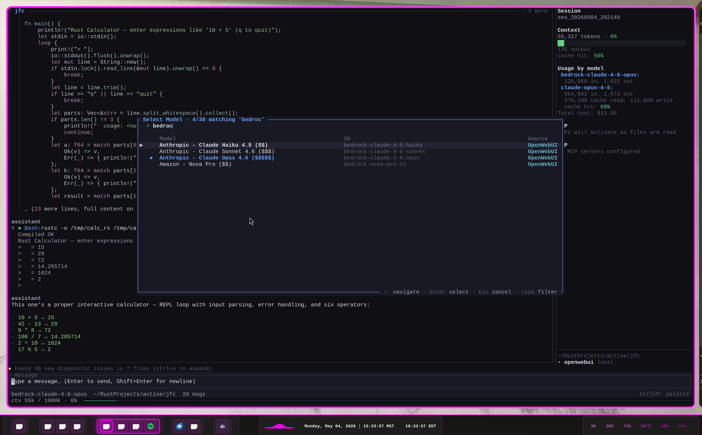

# jfc

A high-performance AI coding agent for the terminal. It combines a Rust ratatui UI, durable background workers, persistent swarms, code-graph intelligence, provider OAuth, MCP tools, and a competitive solver/validator bounty market.


<p align="center">
  
</p>

## Highlights

- **Full agentic loop** — streaming responses, tool calls, approval modes, task tracking, auto-compaction, and cancellation.
- **Foreground + detached background agents** — `Task` can run inline or fork a durable `jfc daemon worker` process that survives the TUI.
- **Persistent swarms** — spawn named teammates, send mailbox messages, share task lists/memory, and gate teammate tools through leader approval.
- **Code graph intelligence** — tree-sitter graph queries, callers/callees, path search, taint/preconditions, coverage metadata, and semantic `symbol_edit` cascades.
- **Bounty marketplace** — post coding bounties, run competing solver agents, adversarial validators, settlement, trust, and token ledger accounting.
- **Multi-provider auth** — Anthropic API/OAuth, OpenAI, Codex/ChatGPT OAuth, OpenWebUI/LiteLLM, Bedrock, and Vertex provider foundations.
- **MCP + Skills + tools** — local tools, remote MCP tools, skill files, memories, web fetch/search, notebooks, cron, wakeups, LSP, notifications, and webhooks.

---

## Architecture

```text
jfc/
├── crates/
│   ├── jfc-ui/             # Main binary: TUI, event loop, tools, providers, swarm, daemon
│   ├── jfc-graph/          # Code graph, DSL, symbol table, coverage, semantic edit validation
│   ├── jfc-economy/        # Bounty lifecycle, solvers, validators, trust, ledger, settlement
│   └── jfc-anthropic-sdk/  # Anthropic managed-session / SDK foundations
├── .claude/skills/         # Declarative skill files
├── .claude/agents/         # Optional project agent definitions
└── .jfc/memory/            # Persistent project memories
```

The central runtime shape is `AppEvent` → `BackgroundTask`: foreground subagents, detached workers, swarm teammates, and bounty solver/validator agents all stream progress into the same fan/task UI model.

## Feature Map

### Core Agent + TUI

| Feature | Description |
| --- | --- |
| **Multi-provider** | Anthropic API/OAuth, OpenAI, Codex OAuth, OpenWebUI/LiteLLM, Bedrock, Vertex. |
| **Streaming tool loop** | Models emit tool calls, jfc executes tools, returns tool results, and continues until completion. |
| **Approval modes** | `plan`, `default`, `acceptEdits`, `auto`, and `bypass` modes; Shift+Tab cycles in the TUI. |
| **Tools** | Bash, Read, Write, Edit, MultiEdit, Glob, Grep, Task, memory, teams, graph, market, web, MCP, cron, LSP, notebooks, notifications. |
| **Session persistence** | Auto-save, `--continue`, `/continue`, `/resume`, session picker/sidebar, cwd mismatch warnings. |
| **Context management** | Token gauge, auto-compaction, forced `/compact`, subagent history compaction, byte-budget tool-result caps. |
| **Diagnostics** | Cargo diagnostics and LSP hover/definition/references surfaced in the UI. |
| **Rendering** | Markdown rendering, syntax highlighting, virtual scroll, cached tool/message heights, task fan/sidebar. |
| **Advisor** | Optional `/advisor <question>` runs a parallel advisor call against a transcript snapshot. |

### Agents, Background Workers, and Swarms

| Mode | What it does |
| --- | --- |
| **Foreground `Task`** | Runs an in-process one-shot subagent, streams `AgentChunk` and `TaskProgress` live into the fan/task panel. |
| **Detached background `Task`** | `run_in_background=true` writes a launch spec and forks `jfc daemon worker --launch <json>`; logs/state hydrate back into the UI. |
| **Worktree-isolated `Task`** | `isolation="worktree"` creates `.jfc-worktrees/<name>` and runs tools from that checkout. |
| **Teammate spawn** | `Task` with `name` + `team_name` creates a persistent teammate addressable with `SendMessage`. |
| **Swarm task claiming** | Teammates can claim unowned team tasks from the shared `TaskStore`. |
| **Permission sync** | Plan-mode teammates write permission requests; leader resolves with `/swarm-approve` or `/swarm-deny`. |
| **Mailbox** | File-backed inboxes deliver teammate messages, idle notifications, and shutdown requests. |

Example model-callable `Task` shapes:

```json
{
  "description": "Explore graph query internals",
  "prompt": "Trace graph_query from tool dispatch into jfc-graph.",
  "subagent_type": "Explore",
  "run_in_background": false
}
```

```json
{
  "description": "Run long verification",
  "prompt": "Run the relevant tests and summarize failures.",
  "run_in_background": true,
  "isolation": "worktree"
}
```

```json
{
  "description": "Spawn backend reviewer",
  "prompt": "Watch the task list and review backend tasks.",
  "name": "backend-reviewer",
  "team_name": "review-swarm",
  "mode": "plan"
}
```

### Daemon / Durable Jobs

| Command | Description |
| --- | --- |
| `jfc daemon start` | Run the daemon loop in the foreground. |
| `jfc daemon stop` | Stop the running daemon via PID file. |
| `jfc daemon status` | Show daemon health and counts. |
| `jfc daemon list` | List cron jobs and wakeups. |
| `jfc daemon fire <id>` | Manually fire a cron job once. |
| `jfc daemon agents` | List persistent background-agent roster. |
| `jfc daemon logs <id> --lines N` | Print recent log lines for a detached agent. |
| `jfc daemon attach <id>` | Follow a detached agent log until terminal state. |
| `jfc daemon wait <id> --timeout-secs N` | Wait for a detached agent to complete/fail/cancel. |
| `jfc daemon kill <id>` | Request cancellation for a detached agent. |

Model-callable daemon tools include `CronCreate`, `CronList`, `CronDelete`, and `ScheduleWakeup`.

### Code Graph (`jfc-graph`)

The graph subsystem builds a symbol/call/type graph from the workspace and exposes it through the `graph_query` tool.

| Capability | Example |
| --- | --- |
| Entrypoints | `entrypoints`, `entrypoints kind=PublicApi` |
| Function/type search | `fn("execute_tool")`, `type("Config")` |
| Traversal | `fn("execute_task") \| callees \| depth 3` |
| Callers | `fn("record_background_agent_progress") \| callers` |
| Set algebra | `fn("spawn") union fn("worker")`, `A intersect B`, `A \ B` |
| Paths | `path fn("stream_response") -> fn("execute_tool")` |
| Taint | `fn("parse") \| taint "input" \| depth 5` |
| Preconditions | `fn("dangerous_op") \| callers \| preconditions` |
| Coverage | `run_coverage`, then `entrypoints kind=PublicApi \| untested` |
| Possible types | `fn("handler") \| possible_types` |
| Symbol editing | Use `--- handles ---` from `graph_query`, then `symbol_edit(handle, new_content, validate=true)`. |
| Cascade planning | `symbol_edit(..., validate=true, dispatch_cascade=true)` queues per-file cascade tasks. |

The graph session memoizes query results and invalidates caches after edits. Query output includes structured handles so the model can chain precise follow-up queries or edits without grep.

### Bounty Market (`jfc-economy`)

| Feature | Description |
| --- | --- |
| **Post** | `post_bounty` registers a task with a token budget and acceptance criteria. |
| **Solve** | `run_bounty` spawns 1-5 solver agents; each produces a patch/FILE blocks. |
| **Validate** | Validator agents inspect surviving solutions in sealed sessions and propose flaws/tests. |
| **Settle** | The market ranks solutions, pays winners, updates trust, and records ledger usage. |
| **Apply** | Winning solution content is written to disk and audit artifacts land under `.jfc/bounties/<id>/`. |
| **Inspect** | `/market` or `market_status` shows bounty state, spend, health, trust, and collusion signals. |

### Providers and Authentication

| Provider | Notes |
| --- | --- |
| Anthropic API | Standard API-key provider. |
| Anthropic OAuth | Multi-account Claude.ai OAuth with account list/switch/disable/remove. Sensitive CCH/billing pieces are behind `anthropic-oauth-sensitive`. |
| OpenAI | OpenAI-compatible chat/responses provider path. |
| Codex OAuth | ChatGPT/Codex OAuth foundation with browser login, device flow, status, logout, and URL/header rewriting hooks. |
| OpenWebUI / LiteLLM | OpenAI-compatible local/proxy providers. LiteLLM dynamically fetches all models from the configured instance. |
| Bedrock / Vertex | Cloud-provider foundations and setup wizards. |

Useful auth commands:

```bash
jfc auth anthropic login [name]
jfc auth anthropic list
jfc auth anthropic switch <name>
jfc auth codex login
jfc auth codex device
jfc auth codex status
jfc auth codex logout
jfc auth litellm login --url <URL> --key <KEY>
jfc auth litellm status
jfc auth litellm logout
```

Inside the TUI, `/login` shows provider-specific login options.

### Tools

Core filesystem/shell tools:

- `Bash`, `Read`, `Write`, `Edit`, `MultiEdit`, `Glob`, `Grep`
- `TaskCreate`, `TaskUpdate`, `TaskList`, `TaskDone`, `TaskGet`
- `Task`, `Skill`, `ToolSearch`, `ToolSuggest`
- `MemoryCreate`, `MemoryDelete`
- `TeamCreate`, `TeamDelete`, `SendMessage`, `TeamMemberMode`
- `GraphQuery`, `RunCoverage`, `SymbolEdit`
- `PostBounty`, `RunBounty`, `MarketStatus`
- `AskUserQuestion`, `EnterPlanMode`, `ExitPlanMode`
- `WebFetch`, `WebSearch`
- `CronCreate`, `CronList`, `CronDelete`, `ScheduleWakeup`
- `Monitor`, `LSP`, `PushNotification`, `RemoteTrigger`
- `EnterWorktree`, `ExitWorktree`
- `NotebookRead`, `NotebookEdit`
- MCP-advertised `mcp__server__tool` calls

---

## Installation

Requires Rust nightly / edition 2024.

```bash
git clone https://github.com/coleleavitt/jfc.git
cd jfc
cargo install --path crates/jfc-ui
```

For a local dev binary:

```bash
cargo build -p jfc-ui --bin jfc
./target/debug/jfc
```

Public build without sensitive Anthropic OAuth feature:

```bash
cargo build -p jfc-ui --bin jfc --no-default-features --features hooks,permission-automation
```

## Usage

```bash
# Interactive TUI
jfc

# Resume most recent session
jfc --continue

# Resume specific session
jfc --resume <session-id>

# Print mode / one-shot prompt
jfc -p "explain this codebase"

# Specific model
jfc --model claude-sonnet-4-6-20250514

# Remote managed session bridge
jfc --remote-session <session-id>

# Daemon / detached agent utilities
jfc daemon start
jfc daemon status
jfc daemon agents
jfc daemon attach <task-id>
```

## Slash Commands

| Command | Description |
| --- | --- |
| `/help` | Show command/key help. |
| `/clear` | Clear conversation and start a fresh session/task store. |
| `/compact` | Queue manual context compaction. |
| `/advisor <question>` | Ask a parallel advisor call, if `JFC_ADVISOR_ENABLED=1`. |
| `/check` | Re-run cargo-check diagnostics reminder/refresh path. |
| `/config [path]` | Show parsed config or config file path. |
| `/continue [all]` / `/c` | Continue most recent session for cwd or globally. |
| `/resume <id> [--force]` | Resume a saved session. |
| `/sessions` | List saved sessions. |
| `/rename <title>` | Rename the active session. |
| `/workflow` / `/wf` | Workflow helper. |
| `/login [provider]` | Provider login chooser/helpers. |
| `/batch` | Batch prompt helper. |
| `/diff` | Show current git diff. |
| `/undo` | Undo recent tool edit where supported. |
| `/export` | Export transcript. |
| `/verbose` | Toggle verbose rendering. |
| `/pin` / `/unpin` | Pin or unpin transcript messages. |
| `/timeline` | Show session/tool timeline. |
| `/doctor` | Diagnose local config/provider environment. |
| `/effort <low|medium|high>` | Set reasoning effort. |
| `/feature` | Feature flag helper. |
| `/goal <condition|clear>` | Keep working toward a goal condition. |
| `/memory` / `/mem` | List memories or manage memory recall. |
| `/skills` | List loaded skill files. |
| `/agents` | List loaded agent definitions. |
| `/market` | Show bounty-market status. |
| `/cascade` | Show cascade tasks queued by `symbol_edit`. |
| `/graph-history` | Show recent graph queries and result counts. |
| `/tasks` | Show task list. |
| `/task-add <subject>` | Create a task. |
| `/task-done <id>` | Mark task complete. |
| `/task-rm <id>` | Delete a task. |
| `/claude-md` | Show loaded CLAUDE.md instruction layers. |
| `/mode <name>` | Show/switch permission mode. |
| `/auto-mode on|off|status` | Toggle classifier-based auto approval. |
| `/worktree ...` | Manage `.jfc-worktrees/<name>` branches. |
| `/mcp [list|restart|logs]` | Inspect/restart MCP servers. |
| `/theme [name]` | Pick or persist a theme. |
| `/fleet` | Open fleet/daemon dashboard. |
| `/teleport ...` | Session/branch teleport helper. |
| `/init` | Initialize project config/instructions. |
| `/cost` / `/stats` | Show usage/cost stats. |
| `/bug` | Bug-report helper. |
| `/rewind` | Rewind transcript state. |
| `/output-style` / `/style` / `/brief` | Change response style. |
| `/dump-context` | Debug the model context. |
| `/install-github-app` | Install GitHub app for the repo. |
| `/pr <num>` | Show PR metadata and review comments. |
| `/pr-autofix <num>` | Build/send a PR autofix prompt. |
| `/setup-github-actions [force]` | Write the jfc review workflow. |
| `/swarm-approve <id>` / `/swarm-deny <id>` | Resolve teammate permission requests. |

## Keybindings

| Key | Action |
| --- | --- |
| `Enter` | Send message. |
| `Shift+Enter` | Newline in input. |
| `Shift+Tab` | Cycle permission mode. |
| `Ctrl+P` | Command palette. |
| `Ctrl+B` | Toggle sessions sidebar. |
| `Ctrl+S` | Toggle info sidebar. |
| `Ctrl+M` | Open model picker. |
| `Ctrl+O` | Expand reasoning / diagnostic panel. |
| `Alt+.` / `Alt+,` | Raise/lower reasoning effort. |
| `Ctrl+Y` | Yank last assistant message to clipboard. |
| `Ctrl+C` | Cancel streaming / exit. |
| `Esc` | Dismiss popup / close panel. |
| `@` | Autocomplete file paths. |
| `↑/↓` | Scroll or recall input history depending on focus/input state. |

## Configuration

Primary config path:

```text
~/.config/jfc/config.toml
```

Example:

```toml
[model]
default = "claude-sonnet-4-6-20250514"

[compact]
auto_pct = 80

[permissions]
mode = "default" # plan | default | accept | auto | bypass

[daemon]
max_sessions = 5
cleanup_after_hours = 24

# Per-subagent model overrides (optional)
[agents.Explore]
model = "litellm/qwen/qwen3.6-35b-a3b:coding"

[agents.general-purpose]
model = "litellm/deepseek-r1"

[agents.Plan]
model = "claude-opus-4-7"

[agents.verification]
model = "litellm/qwen/qwen3.6-35b-a3b:coding"

[agents.orchestrator]
model = "claude-sonnet-4-6"
```

Project feature config can live at `.jfc/features.toml`:

```toml
[permissions]
enabled = true

[background]
max_concurrent = 10
```

Agent configs support per-agent model/tool/permission overrides in config and `.claude/agents/*.md` frontmatter. Skills live in `.claude/skills/*.md`.

Built-in subagent types and their defaults:

| Subagent | Default Model | Role |
| --- | --- | --- |
| `Explore` | `haiku` | Read-only codebase search and grep |
| `general-purpose` | inherit (parent) | Multi-step tasks with full tool access |
| `Plan` | inherit (parent) | Architecture design, read-only planning |
| `verification` | inherit (parent) | Post-edit testing, tries to break things |
| `orchestrator` | inherit (parent) | Decomposes broad requests into subtask plans |

Override any subagent's model via `[agents.<name>].model` in config.toml. Resolution order (highest priority first):

1. `CLAUDE_CODE_SUBAGENT_MODEL` env var (global override for all subagents)
2. Per-call `model` field in the Task tool invocation
3. `config.toml [agents.<name>].model`
4. `.claude/agents/<name>.md` frontmatter `model:` field
5. Parent session model (inherit)

Useful environment knobs:

| Env var | Effect |
| --- | --- |
| `JFC_LITELLM_API_KEY` | LiteLLM proxy API key (alternative to `jfc auth litellm login`). |
| `JFC_LITELLM_API` | LiteLLM proxy base URL (e.g. `https://api.example.com/v1`). |
| `JFC_LITELLM_MODEL` | Default model to use from the LiteLLM instance. |
| `JFC_DISABLE_BELL=1` | Silence terminal bell on tool completion. |
| `JFC_DISABLE_AUTO_COMPACT=1` | Disable auto-compaction. |
| `JFC_DISABLE_CARGO_CHECK=1` | Skip startup cargo-check diagnostics. |
| `JFC_AUTOCOMPACT_PCT_OVERRIDE=N` | Override compaction threshold. |
| `JFC_TOOL_TITLE_WIDTH=N` | Cap rendered tool title length. |
| `JFC_ADVISOR_ENABLED=1` | Enable `/advisor`. |
| `JFC_WORKER_BIN=/abs/path/jfc` | Force detached worker executable path. |
| `JFC_GRAPH_CAP_*` | Toggle graph capabilities such as call graph, partial structs, validation. |

## Agent and Skill Files

Skills are Markdown files in `.claude/skills/` with optional YAML frontmatter:

```markdown
---
name: my-skill
description: Domain-specific instructions
---
Instructions for the agent when this skill is invoked.
```

Agents are Markdown files in `.claude/agents/` with YAML frontmatter:

```markdown
---
name: Explore
model: openai/gpt-5.1
permissionMode: default
allowedTools: [Read, Glob, Grep, graph_query]
disallowedTools: [Write, Edit]
skills: [ripgrep]
isolation: worktree
---
You explore codebases and report concise, cited findings.
```

Built-in skills include `do-178b`, `vuln-researcher`, `git-master`, `rust-style`, `tracing`, `snafu`, `thiserror`, and `ripgrep`.

## Performance Notes

- Markdown/tool rendering is cached by content hash and viewport width.
- Message view uses virtual scrolling and cached tool heights.
- Read-only tools can be dispatched in parallel.
- Detached background workers avoid blocking the TUI event loop.
- Graph sessions memoize queries and invalidate after file edits.
- Subagents auto-compact or elide history before oversized requests.

## Development

```bash
cargo fmt --all --check
cargo check -p jfc-ui
cargo test -p jfc-ui app::tests::
cargo test -p jfc-ui daemon::tests::
cargo test -p jfc-graph
cargo test -p jfc-economy
```

## License

[AGPL-3.0](LICENSE)
