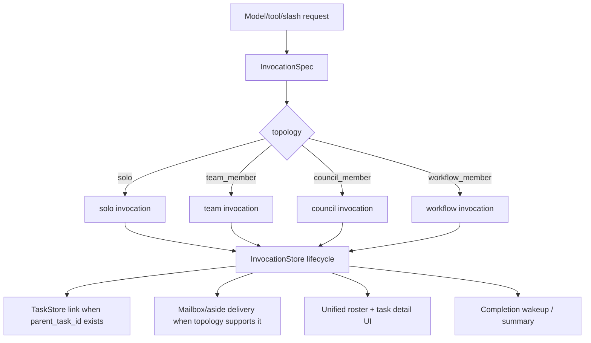
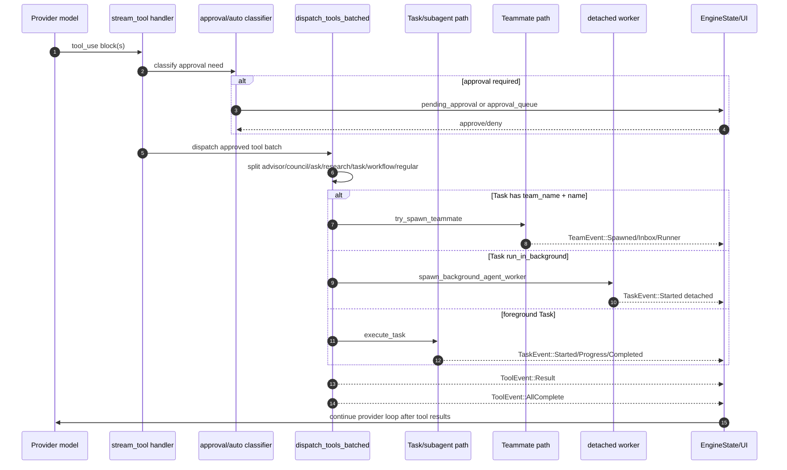
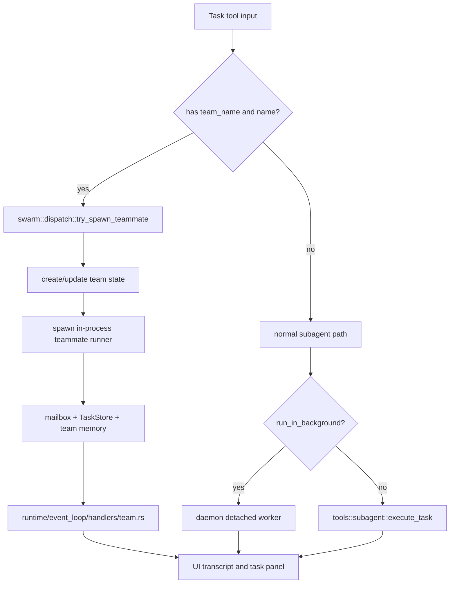
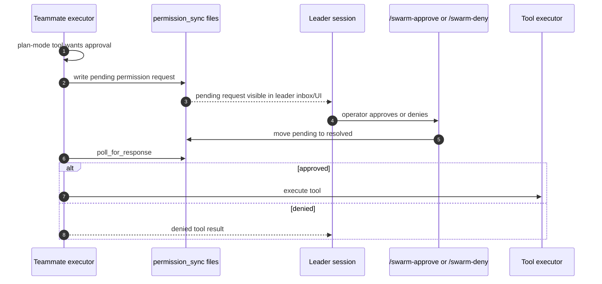
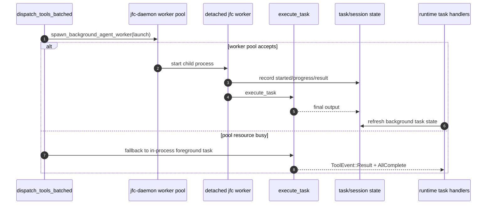
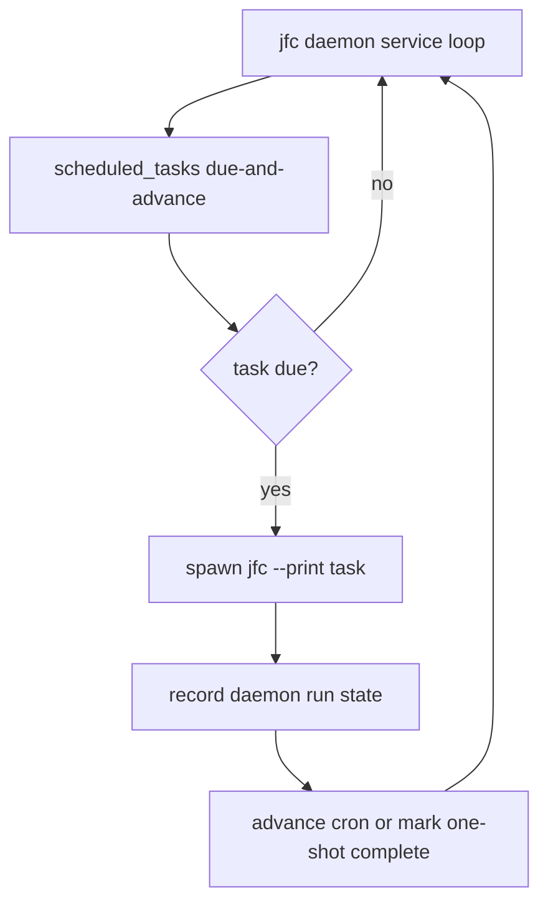
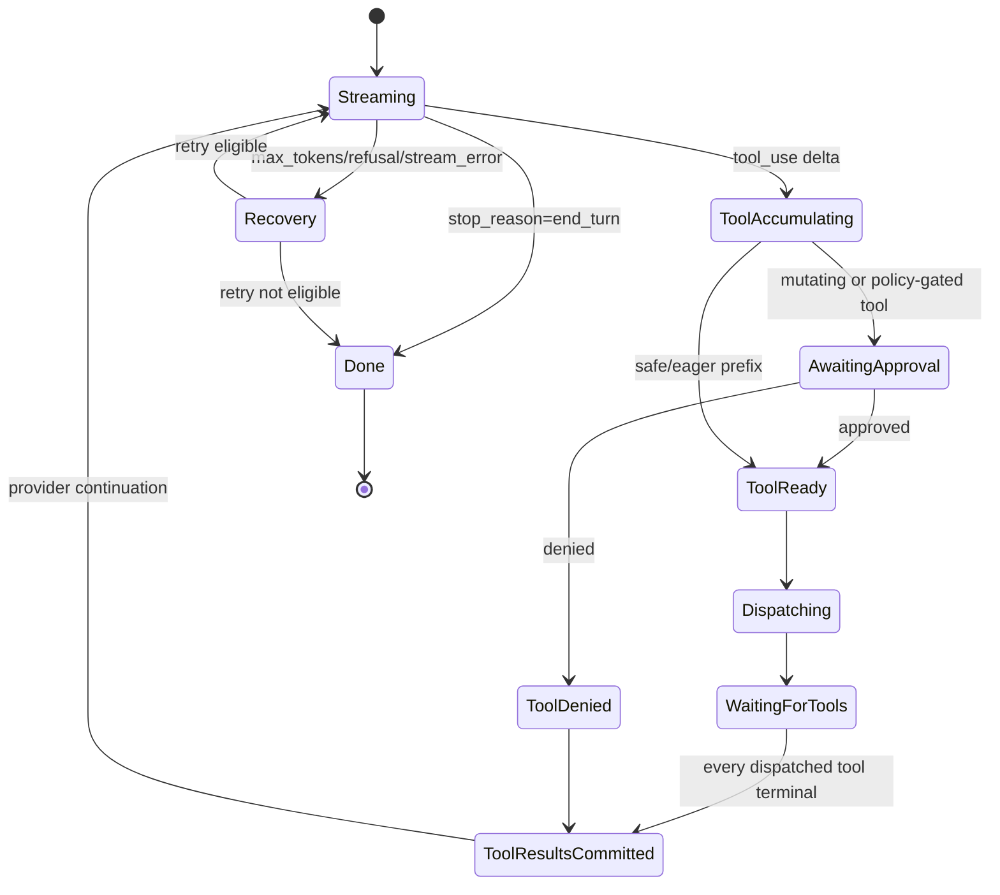

# JFC agent and team execution flow

This is a source-backed map of the current JFC agent execution paths. It is meant to make the runtime easier to reason about before deeper refactors.

## Source map

| Area | Primary source |
| --- | --- |
| Provider streaming into the event loop | `crates/jfc-engine/src/runtime/event_loop/handlers/stream_chunk.rs`, `stream_tool.rs`, `stream_done.rs` |
| Batched tool dispatch | `crates/jfc-engine/src/stream/tool_dispatch.rs` |
| Foreground and detached subagents | `crates/jfc-engine/src/tools/subagent.rs`, `crates/jfc-engine/src/daemon` |
| Persistent teammate path | `crates/jfc-engine/src/swarm/dispatch.rs`, `crates/jfc-engine/src/swarm/runner.rs`, `crates/jfc-engine/src/runtime/event_loop/handlers/team.rs` |
| Task store surface | `crates/jfc-engine/src/tools/tasks.rs`, `crates/jfc-session` |
| Approval UI and queue | `crates/jfc/src/render/approval.rs`, `crates/jfc-engine/src/runtime/event_loop/handlers/stream_tool.rs`, `tools.rs` |
| Workflows and fanout agents | `crates/jfc-engine/src/workflows/runner.rs`, `runtime/event_loop/handlers/workflow.rs` |
| Agent/team roster UI | `crates/jfc/src/render/agents.rs`, `teammates_panel.rs`, `roster.rs`, `crates/jfc-engine/src/runtime/event_loop/handlers/team.rs` |
| Model council one-shot + agentic mode | `crates/jfc-engine/src/council.rs`, `commands/context.rs`, `tools/defs/agents.rs` |
| Turn-based RoundTable council | `crates/jfc-engine/src/council_session.rs`, `commands/council.rs` |

## Current architecture problem

JFC has one domain concept with several names: **an invoked agent-like worker**.
Today each worker shape owns a different slice of routing, lifecycle, and UI:

| Shape | Routing entry | Lifetime | UI/state truth today | Problem |
| --- | --- | --- | --- | --- |
| One-shot subagent | `Task` without `name + team_name` in `tool_dispatch.rs` | foreground task loop | `BackgroundTask` + `TaskStatus` message part | Separate from teams despite being a short-lived team member. |
| Detached subagent | `Task.run_in_background=true` | daemon worker | daemon registry + restored `BackgroundTask` | Same task contract, different persistence and completion wakeup path. |
| Persistent teammate | `Task` with `name + team_name` in `swarm::dispatch` | in-process loop with mailbox | `TeamContext.teammates`, team file, `BackgroundTask` | Two lifecycle authorities drifted; completed teammates could still look active. |
| Workflow worker | `Workflow` tool | background JS workflow | `BackgroundTask.workflow_progress` | Own progress schema, not modeled as a team topology. |
| One-shot council member | `Council` direct mode | parallel model completion | `CouncilReport` only | Invisible to the agent roster/task lifecycle. |
| Agentic council member | `Council` agentic mode | read-only task-backed member | private `execute_task` calls | Uses subagents internally but bypasses team topology and UI roster. |
| RoundTable council seat | `/council start ...` | persistent deliberation state machine | `CouncilSession` transcript/seat fields | Another roster + governance model not connected to task/team lifecycle. |

The bug fixed in this pass came from that split: the Agents modal rendered the
team section from `TeamContext.teammates.abort_tx` while the canonical row above
rendered from `BackgroundTask.status`. A completed teammate could therefore show
as completed in one row and running in another.

## Target model: team-backed invocation

The refactor target should not be “delete teams” or “make every task persistent.”
It should introduce one invocation record with topology + lifetime knobs:

```text
Invocation
├── identity: invocation_id, display_name, agent_type/category, model/provider
├── topology: solo | team_member(team_id) | council_member(council_id) | workflow_member(run_id)
├── lifetime: foreground | detached | persistent
├── permissions: inherited | plan-gated | read-only | bypass
├── isolation: cwd | worktree | daemon_process
├── mailbox: none | team_mailbox | council_aside
└── lifecycle: Pending | Running | Idle | Completed | Failed | Cancelled
```

Under that model:

1. `Task` becomes a convenience constructor for an `Invocation`.
2. A “subagent” is just `topology=solo`, `lifetime=foreground|detached`.
3. A teammate is `topology=team_member`, `lifetime=persistent`.
4. Agentic council members are `topology=council_member`, usually `lifetime=foreground`, with read-only permissions and optional blind visibility.
5. RoundTable council seats become long-lived council-member invocations with extra governance state (stance, asides, vote/challenge allowance), not a completely separate execution family.
6. UI renders one roster from one lifecycle source, then groups by topology.



## Refactor seam to cut first

Do **not** start by rewriting `execute_task` or `CouncilSession`. The safest seam
is a typed dispatch boundary in front of them:

```rust
enum InvocationTopology {
    Solo,
    TeamMember { team_name: String, name: String },
    CouncilMember { council_id: String, blind: bool },
    WorkflowMember { run_id: String },
}

enum InvocationLifetime {
    Foreground,
    Detached,
    Persistent,
}
```

Then route current lanes into the same lifecycle sink before deeper extraction:

- `tool_dispatch.rs` should classify into `InvocationSpec`, not ad-hoc vectors of
  task/workflow/advisor/council calls.
- `swarm::dispatch::try_spawn_teammate` should become a team-member invocation
  launcher.
- `council::run_agentic_council` should launch council-member invocations instead
  of private `execute_task` calls.
- `runtime/event_loop/handlers/task.rs` and `team.rs` should converge around one
  lifecycle transition helper.
- `render/agents.rs`, `render/teammates_panel.rs`, and `render/task_panel.rs`
  should keep using `render/roster.rs` as the row/detail source of truth.

## High-level tool and subagent sequence



## Team/teammate flow



## Swarm permission flow



## Detached background worker flow



## Scheduled daemon flow



## Provider/tool loop state machine



## Slop and refactor targets

1. `crates/jfc-engine/src/stream/tool_dispatch.rs` mixes tool classification, approval-sensitive splitting, council/advisor/research dispatch, teammate dispatch, detached worker fallback, and foreground subagent execution. The file is the central flow knot and should be split by dispatch lane.
2. `crates/jfc-engine/src/tools/subagent.rs` owns model selection, agent prompt shaping, execution, harvesting, and verification-agent special cases. Split into model routing, prompt construction, execution, and output harvesting.
3. Team flow is conceptually separate from one-shot subagents but currently enters through the same Task tool branch. The diagrams show why a typed `DelegationKind` boundary would make this clearer than checking for `team_name`/`name` deep inside dispatch.
4. The approval system is tool-call-specific. The new council approval gate added for RoundTable actions is separate because forcing non-tool governance actions into `pending_approval` would blur UI semantics.
5. Multiple files exceed the 250 pure-LOC review ceiling. Future work should extract without adding to the monoliths: especially `tool_dispatch.rs`, `tools/subagent.rs`, `stream_done.rs`, `tools/dispatch.rs`, and `commands/council.rs`.
6. `EngineState` is a god-state object: approvals, providers, teams, background tasks, budgets, stream lifecycle, reminders, and UI-neutral effects all converge there. Before more features land, extract state domains behind typed sub-structs.
7. Swarm state has four authorities: `TeamContext`, on-disk team JSON, mailbox files, and task store. The system works, but state ownership is hard to audit without these diagrams.

## Proposed split for `tool_dispatch.rs`

```text
stream/tool_dispatch/
├── mod.rs              # public dispatch_tools_batched entrypoint
├── classify.rs         # split ToolCall into dispatch lanes
├── special.rs          # advisor/council/ask-model/research runners
├── task_lane.rs        # normal foreground/detached Task handling
├── teammate_lane.rs    # team_name/name teammate path
├── workflow_lane.rs    # workflow tool path
└── regular_lane.rs     # ordinary tool batch execution
```

The split should happen behind tests that lock the current lane routing: advisor, council, ask-model, research, teammate, detached task, foreground task, workflow, and regular tools.
